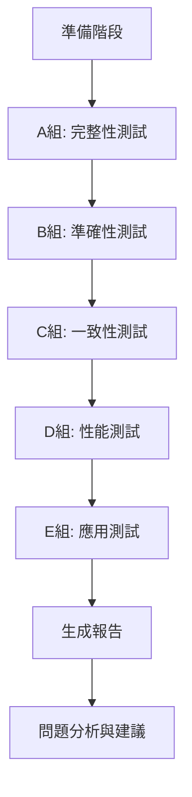

# 資料庫品質測試規格文檔

**功能**: 標籤分類資料庫的全面品質驗證與測試  
**版本**: v1.0  
**創建日期**: 2025-10-13  
**狀態**: 規格完成 ✅  
**優先級**: P0 (Critical)

---

## 📋 目錄

1. [概述](#概述)
2. [背景與目標](#背景與目標)
3. [使用者場景](#使用者場景)
4. [功能需求](#功能需求)
5. [成功標準](#成功標準)
6. [測試場景設計](#測試場景設計)
7. [數據實體](#數據實體)
8. [假設與依賴](#假設與依賴)
9. [風險與限制](#風險與限制)

---

## 概述

### 功能摘要
對已達成 96.56% 覆蓋率的標籤分類資料庫進行全面品質驗證，通過 10 個精心設計的使用場景測試，確保數據品質、分類準確性、一致性和實用性，為 Stage 2 遷移提供可靠的數據基礎。

### 核心價值
- **品質保證**: 驗證 135,941 個已分類標籤的準確性
- **一致性驗證**: 確保分類邏輯的一致性和可預測性
- **實用性驗證**: 確認資料庫能支持實際 AI 繪圖 Prompt 生成場景
- **問題發現**: 識別潛在的數據品質問題並提供修復建議

### 範圍界定

**包含**:
- 10 個符合 MECE 原則的測試場景
- 涵蓋完整性、準確性、一致性、性能、應用 5 個維度
- 自動化測試腳本
- 詳細的測試報告生成

**不包含**:
- 數據修復實施（僅識別問題）
- Stage 2 遷移測試
- 前端應用測試
- API 接口測試

---

## 背景與目標

### 業務背景
Prompt-Scribe 項目已完成 Plan C 的三個階段，達成了 96.56% 的標籤分類覆蓋率目標。在進入 Stage 2 遷移之前，需要全面驗證資料庫的品質，確保：
1. 分類數據準確可靠
2. 能夠支持實際的 Prompt 生成需求
3. 數據品質符合生產環境標準

### 目標
1. **驗證覆蓋率**: 確認各頻率段、各分類的覆蓋率達標
2. **驗證準確性**: 確保分類邏輯正確，無明顯誤分類
3. **驗證一致性**: 確保相似標籤分類一致
4. **驗證性能**: 確保查詢效率滿足實時需求
5. **驗證實用性**: 確認能支持完整的 Prompt 生成流程

### 目標用戶
- **開發團隊**: 需要確認數據品質以進行 Stage 2 開發
- **數據科學家**: 需要驗證分類模型的有效性
- **專案經理**: 需要品質報告以決定是否進入下一階段

---

## 使用者場景

### 場景 1: 數據品質驗證者檢查分類覆蓋率
**角色**: 數據品質驗證者  
**目標**: 確認資料庫達到預期的覆蓋率目標

**流程**:
1. 驗證者運行完整性測試腳本
2. 系統自動查詢各主分類、各頻率段的覆蓋率
3. 系統生成覆蓋率分布報告
4. 驗證者檢查報告，確認所有維度都達標
5. 驗證者標記測試通過或記錄問題

**預期結果**: 
- 獲得完整的覆蓋率報告
- 識別覆蓋不足的區域
- 決定是否需要進一步處理

---

### 場景 2: AI 繪圖應用開發者測試 Prompt 生成
**角色**: AI 繪圖應用開發者  
**目標**: 驗證資料庫能支持完整的 Prompt 生成流程

**流程**:
1. 開發者模擬用戶構建 Prompt 的過程
2. 依序查詢：角色數量 → 髮型 → 服裝 → 姿態 → 場景 → 風格
3. 系統返回每個類別的高頻標籤選項
4. 開發者驗證每個維度都有足夠且合適的選項
5. 開發者組合標籤，生成完整 Prompt

**預期結果**:
- 每個維度都有 10+ 個高品質選項
- 標籤組合後語義通順
- 覆蓋常見的繪圖需求

---

### 場景 3: 品質工程師執行一致性檢查
**角色**: 品質工程師  
**目標**: 確保相似標籤的分類邏輯一致

**流程**:
1. 工程師運行一致性測試腳本
2. 系統檢查特定模式標籤（如 *_eyes, *_hair）的分類
3. 系統識別分類不一致的案例
4. 工程師審查不一致案例，判斷是否為誤分類
5. 工程師生成一致性報告和修復建議

**預期結果**:
- 同類標籤一致性 >95%
- 識別所有不一致案例
- 提供修復建議清單

---

## 功能需求

### FR1: 完整性測試功能
**描述**: 系統能夠自動測試數據在各維度的覆蓋完整性

**子需求**:
- FR1.1: 測試所有主分類的標籤分布
- FR1.2: 測試各頻率段的覆蓋率（>=1M, 100K-1M, 10K-100K, 1K-10K, 100-1K, <100）
- FR1.3: 測試 Danbooru 原生分類的轉換完整性
- FR1.4: 生成覆蓋率矩陣報告（主分類 × 頻率段）

**驗收標準**:
- 能識別所有 17 個主分類的覆蓋情況
- 能計算 6 個頻率段的精確覆蓋率
- 能驗證 5 種 Danbooru 分類的轉換率
- 報告包含具體的缺失標籤清單

---

### FR2: 準確性測試功能
**描述**: 系統能夠驗證分類的正確性和信心度

**子需求**:
- FR2.1: 測試副分類的邏輯準確性（HAIR vs CLOTHING vs BODY_PARTS）
- FR2.2: 分析各主分類的信心度分布
- FR2.3: 識別邊界案例和可能的誤分類
- FR2.4: 驗證成人內容分類的準確性和敏感度

**驗收標準**:
- 能自動檢測模式匹配錯誤（如 *_eyes 不在 BODY_PARTS）
- 能計算每個主分類的平均/最小/最大信心度
- 能列出所有低信心度標籤（<0.75）
- 能驗證 ADULT_CONTENT 分級的準確性

---

### FR3: 一致性測試功能
**描述**: 系統能夠檢測和報告分類邏輯的一致性

**子需求**:
- FR3.1: 檢測同模式標籤的分類一致性（如所有 *_eyes）
- FR3.2: 比較不同分類來源的品質差異
- FR3.3: 識別分類矛盾或異常
- FR3.4: 生成一致性問題清單

**驗收標準**:
- 能計算特定模式的一致性百分比
- 能對比 15+ 種分類來源的品質指標
- 能自動發現不一致案例
- 報告包含優先級排序的修復建議

---

### FR4: 性能測試功能
**描述**: 系統能夠測試典型查詢的執行效率

**子需求**:
- FR4.1: 測試單條件查詢性能（如查找所有服裝標籤）
- FR4.2: 測試多條件組合查詢性能
- FR4.3: 測試排序和限制查詢的效率
- FR4.4: 生成查詢計劃分析報告

**驗收標準**:
- 單條件查詢執行時間 <50ms
- 複雜組合查詢執行時間 <200ms
- 能生成 EXPLAIN QUERY PLAN 分析
- 能提供索引優化建議

---

### FR5: 應用場景測試功能
**描述**: 系統能夠模擬實際應用場景並驗證可用性

**子需求**:
- FR5.1: 模擬完整 Prompt 生成流程（6-8 個查詢步驟）
- FR5.2: 驗證每個維度的標籤選項充足性
- FR5.3: 測試跨分類關聯查詢（如特定作品的角色）
- FR5.4: 生成實用性評估報告

**驗收標準**:
- 每個 Prompt 維度能提供 10+ 個高頻選項
- 能成功組合出完整且合理的 Prompt
- 跨分類查詢能返回相關聯的標籤
- 報告包含實際應用建議

---

### FR6: 自動化測試執行
**描述**: 系統能夠自動執行所有測試場景並生成報告

**子需求**:
- FR6.1: 提供命令行界面執行所有測試
- FR6.2: 支持單獨執行特定場景
- FR6.3: 自動生成結構化測試報告（Markdown 格式）
- FR6.4: 記錄測試執行歷史和趨勢

**驗收標準**:
- 單一命令可執行全部 10 個場景
- 每個場景可獨立執行
- 報告包含通過/失敗狀態和詳細數據
- 支持 JSON 格式輸出供進一步分析

---

## 成功標準

### 整體品質目標

| 維度 | 指標 | 目標值 | 測量方法 |
|------|------|--------|---------|
| **覆蓋率** | 高頻標籤覆蓋率 (>100K) | 100% | 查詢統計 |
| **覆蓋率** | 中頻標籤覆蓋率 (1K-100K) | >99% | 查詢統計 |
| **覆蓋率** | 低頻標籤覆蓋率 (100-1K) | >90% | 查詢統計 |
| **準確性** | 模式匹配準確率 | >95% | 人工抽樣驗證 |
| **準確性** | 副分類邏輯正確率 | >90% | 規則驗證 |
| **信心度** | 整體平均信心度 | >0.85 | SQL 計算 |
| **信心度** | 低信心度標籤占比 | <10% | SQL 計算 |
| **一致性** | 同模式標籤一致性 | >95% | 模式檢測 |
| **性能** | 單條件查詢時間 | <50ms | 執行計時 |
| **性能** | 複雜查詢時間 | <200ms | 執行計時 |
| **實用性** | Prompt 維度覆蓋 | 6/6 維度 | 場景測試 |
| **實用性** | 每維度可用選項 | >10 個 | 結果計數 |

### 關鍵結果指標 (KRI)

1. **測試通過率**: ≥ 90% 的測試場景完全通過
2. **問題發現**: 識別並記錄所有 P0/P1 級別的品質問題
3. **修復建議**: 為每個發現的問題提供可行的修復方案
4. **報告完整性**: 生成包含 10 個場景結果的完整測試報告

---

## 測試場景設計

### 🎯 **MECE 框架**

所有測試場景按 **5 個互斥維度** 組織，確保無重疊且完整覆蓋：

```
測試維度金字塔 (MECE):
├── A. 數據完整性 (Completeness) - 3 場景
│   ├── A1. 主分類覆蓋度
│   ├── A2. 頻率段覆蓋度  
│   └── A3. Danbooru 轉換完整性
│
├── B. 分類準確性 (Accuracy) - 3 場景
│   ├── B1. 副分類邏輯準確性
│   ├── B2. 信心度分布驗證
│   └── B3. 邊界案例處理
│
├── C. 數據一致性 (Consistency) - 2 場景
│   ├── C1. 同類標籤一致性
│   └── C2. 分類來源品質對比
│
├── D. 查詢性能 (Performance) - 1 場景
│   └── D1. 複雜查詢效率測試
│
└── E. 實際應用 (Application) - 1 場景
    └── E1. Prompt 生成流程驗證
```

---

## **A. 數據完整性測試** (Completeness)

### 場景 A1: 主分類覆蓋度測試

**測試目標**: 驗證所有主分類都有合理的標籤分布

**SQL 查詢**:
```sql
-- 主分類完整統計
SELECT 
    main_category,
    COUNT(*) as tag_count,
    SUM(post_count) as total_usage,
    ROUND(COUNT(*) * 100.0 / (SELECT COUNT(*) FROM tags_final WHERE main_category IS NOT NULL), 2) as tag_percentage,
    ROUND(SUM(post_count) * 100.0 / (SELECT SUM(post_count) FROM tags_final WHERE main_category IS NOT NULL), 2) as usage_percentage
FROM tags_final
WHERE main_category IS NOT NULL
GROUP BY main_category
ORDER BY tag_count DESC;
```

**成功標準**:
- ✅ 所有 17 個主分類都存在
- ✅ 核心分類 (CHARACTER_RELATED, OBJECTS, ACTION_POSE) 占比合理
- ✅ 無主分類標籤占比 <50%（符合實際分布）
- ✅ 使用次數分布與標籤數分布匹配

**失敗處理**:
- 若某主分類缺失 → 記錄為 P0 問題
- 若分布異常 (某分類 >60%) → 記錄為 P1 問題

---

### 場景 A2: 頻率段覆蓋度測試

**測試目標**: 確保各頻率段達到目標覆蓋率

**SQL 查詢**:
```sql
-- 頻率段覆蓋率矩陣
SELECT 
    CASE 
        WHEN post_count >= 1000000 THEN '1. 超高頻 (>=1M)'
        WHEN post_count >= 100000 THEN '2. 極高頻 (100K-1M)'
        WHEN post_count >= 50000 THEN '3. 高頻 (50K-100K)'
        WHEN post_count >= 10000 THEN '4. 中高頻 (10K-50K)'
        WHEN post_count >= 5000 THEN '5. 中頻 (5K-10K)'
        WHEN post_count >= 1000 THEN '6. 中低頻 (1K-5K)'
        WHEN post_count >= 100 THEN '7. 低頻 (100-1K)'
        ELSE '8. 極低頻 (<100)'
    END as frequency_range,
    COUNT(*) as total_tags,
    SUM(CASE WHEN main_category IS NOT NULL THEN 1 ELSE 0 END) as classified_tags,
    COUNT(*) - SUM(CASE WHEN main_category IS NOT NULL THEN 1 ELSE 0 END) as unclassified_tags,
    ROUND(SUM(CASE WHEN main_category IS NOT NULL THEN 1 ELSE 0 END) * 100.0 / COUNT(*), 2) as coverage_rate
FROM tags_final
GROUP BY 
    CASE 
        WHEN post_count >= 1000000 THEN 1
        WHEN post_count >= 100000 THEN 2
        WHEN post_count >= 50000 THEN 3
        WHEN post_count >= 10000 THEN 4
        WHEN post_count >= 5000 THEN 5
        WHEN post_count >= 1000 THEN 6
        WHEN post_count >= 100 THEN 7
        ELSE 8
    END
ORDER BY frequency_range;
```

**成功標準**:
- ✅ 超高頻 (>=1M): 覆蓋率 = 100%
- ✅ 極高頻 (100K-1M): 覆蓋率 = 100%
- ✅ 高頻 (10K-100K): 覆蓋率 >99%
- ✅ 中頻 (1K-10K): 覆蓋率 >99%
- ✅ 低頻 (100-1K): 覆蓋率 >90%

---

### 場景 A3: Danbooru 原生分類完整性測試

**測試目標**: 驗證 Danbooru 原生分類 100% 正確轉換

**SQL 查詢**:
```sql
-- Danbooru 分類轉換統計
SELECT 
    danbooru_cat,
    CASE danbooru_cat
        WHEN 0 THEN '一般標籤 (General)'
        WHEN 1 THEN '藝術家 (Artist)'
        WHEN 3 THEN '版權 (Copyright)'
        WHEN 4 THEN '角色 (Character)'
        WHEN 5 THEN '元標籤 (Meta)'
        ELSE '未知類別'
    END as category_name,
    COUNT(*) as total_tags,
    SUM(CASE WHEN main_category IS NOT NULL THEN 1 ELSE 0 END) as classified_tags,
    COUNT(*) - SUM(CASE WHEN main_category IS NOT NULL THEN 1 ELSE 0 END) as unclassified_tags,
    ROUND(SUM(CASE WHEN main_category IS NOT NULL THEN 1 ELSE 0 END) * 100.0 / COUNT(*), 2) as coverage_rate,
    -- 驗證對應關係
    SUM(CASE 
        WHEN danbooru_cat = 1 AND main_category = 'ARTIST' THEN 1
        WHEN danbooru_cat = 3 AND main_category = 'COPYRIGHT' THEN 1
        WHEN danbooru_cat = 4 AND main_category = 'CHARACTER' THEN 1
        WHEN danbooru_cat = 5 AND main_category IN ('TECHNICAL', 'QUALITY') THEN 1
        WHEN danbooru_cat = 0 THEN 1
        ELSE 0
    END) as correct_mapping
FROM tags_final
GROUP BY danbooru_cat
ORDER BY danbooru_cat;
```

**成功標準**:
- ✅ ARTIST (cat=1) → ARTIST: 100% 轉換
- ✅ COPYRIGHT (cat=3) → COPYRIGHT: 100% 轉換
- ✅ CHARACTER (cat=4) → CHARACTER: 100% 轉換
- ✅ META (cat=5) → TECHNICAL/QUALITY: 100% 轉換
- ✅ GENERAL (cat=0): 覆蓋率 >84%

---

## **B. 分類準確性測試** (Accuracy)

### 場景 B1: 副分類邏輯準確性測試

**測試目標**: 驗證副分類規則的正確執行

**SQL 查詢**:
```sql
-- 檢查 1: 所有眼睛顏色標籤應該在 BODY_PARTS
SELECT '眼睛顏色標籤檢查' as test_name,
       COUNT(*) as total_tags,
       SUM(CASE WHEN main_category = 'CHARACTER_RELATED' AND sub_category = 'BODY_PARTS' THEN 1 ELSE 0 END) as correct_tags,
       COUNT(*) - SUM(CASE WHEN main_category = 'CHARACTER_RELATED' AND sub_category = 'BODY_PARTS' THEN 1 ELSE 0 END) as incorrect_tags,
       ROUND(SUM(CASE WHEN main_category = 'CHARACTER_RELATED' AND sub_category = 'BODY_PARTS' THEN 1 ELSE 0 END) * 100.0 / COUNT(*), 2) as accuracy_rate
FROM tags_final
WHERE name LIKE '%_eyes' OR name LIKE '%_eye';

-- 檢查 2: 所有頭髮標籤應該在 HAIR
SELECT '頭髮標籤檢查' as test_name,
       COUNT(*) as total_tags,
       SUM(CASE WHEN main_category = 'CHARACTER_RELATED' AND sub_category = 'HAIR' THEN 1 ELSE 0 END) as correct_tags,
       COUNT(*) - SUM(CASE WHEN main_category = 'CHARACTER_RELATED' AND sub_category = 'HAIR' THEN 1 ELSE 0 END) as incorrect_tags,
       ROUND(SUM(CASE WHEN main_category = 'CHARACTER_RELATED' AND sub_category = 'HAIR' THEN 1 ELSE 0 END) * 100.0 / COUNT(*), 2) as accuracy_rate
FROM tags_final
WHERE name LIKE '%_hair' OR name LIKE '%_bangs' OR name LIKE '%_ponytail';

-- 檢查 3: 列出所有誤分類案例
SELECT name, main_category, sub_category, post_count, classification_confidence
FROM tags_final
WHERE (
    (name LIKE '%_eyes' AND (main_category != 'CHARACTER_RELATED' OR sub_category != 'BODY_PARTS'))
    OR
    (name LIKE '%_hair' AND (main_category != 'CHARACTER_RELATED' OR sub_category != 'HAIR'))
)
ORDER BY post_count DESC;
```

**成功標準**:
- ✅ 眼睛標籤準確率 >95%
- ✅ 頭髮標籤準確率 >95%
- ✅ 誤分類標籤總數 <50 個
- ✅ 高頻誤分類 (>10K) = 0 個

---

### 場景 B2: 信心度分布驗證測試

**測試目標**: 確保分類品質穩定且可靠

**SQL 查詢**:
```sql
-- 各主分類的信心度統計
SELECT 
    main_category,
    COUNT(*) as total_tags,
    ROUND(AVG(classification_confidence), 3) as avg_confidence,
    ROUND(MIN(classification_confidence), 3) as min_confidence,
    ROUND(MAX(classification_confidence), 3) as max_confidence,
    SUM(CASE WHEN classification_confidence >= 0.90 THEN 1 ELSE 0 END) as high_conf_count,
    SUM(CASE WHEN classification_confidence >= 0.75 AND classification_confidence < 0.90 THEN 1 ELSE 0 END) as medium_conf_count,
    SUM(CASE WHEN classification_confidence < 0.75 THEN 1 ELSE 0 END) as low_conf_count,
    ROUND(SUM(CASE WHEN classification_confidence < 0.75 THEN 1 ELSE 0 END) * 100.0 / COUNT(*), 2) as low_conf_rate
FROM tags_final
WHERE classification_confidence IS NOT NULL
GROUP BY main_category
ORDER BY avg_confidence DESC;

-- 整體信心度分布
SELECT 
    CASE 
        WHEN classification_confidence >= 0.95 THEN '極高 (>=0.95)'
        WHEN classification_confidence >= 0.90 THEN '高 (0.90-0.95)'
        WHEN classification_confidence >= 0.85 THEN '中高 (0.85-0.90)'
        WHEN classification_confidence >= 0.80 THEN '中等 (0.80-0.85)'
        WHEN classification_confidence >= 0.75 THEN '中低 (0.75-0.80)'
        WHEN classification_confidence >= 0.60 THEN '低 (0.60-0.75)'
        ELSE '極低 (<0.60)'
    END as confidence_level,
    COUNT(*) as tag_count,
    ROUND(COUNT(*) * 100.0 / (SELECT COUNT(*) FROM tags_final WHERE classification_confidence IS NOT NULL), 2) as percentage
FROM tags_final
WHERE classification_confidence IS NOT NULL
GROUP BY confidence_level
ORDER BY MIN(classification_confidence) DESC;
```

**成功標準**:
- ✅ 整體平均信心度 >0.85
- ✅ 所有主分類平均信心度 >0.70
- ✅ 高信心度 (>=0.90) 標籤占比 >50%
- ✅ 低信心度 (<0.75) 標籤占比 <10%

---

### 場景 B3: 邊界案例處理測試

**測試目標**: 驗證模糊和特殊案例的處理正確性

**SQL 查詢**:
```sql
-- 1. 複合屬性標籤檢查（包含多個下劃線）
SELECT name, main_category, sub_category, post_count, classification_confidence
FROM tags_final
WHERE name LIKE '%_%_%'
  AND main_category IS NOT NULL
  AND post_count > 10000
ORDER BY post_count DESC
LIMIT 30;

-- 2. NULL 字符串問題檢查
SELECT 'NULL字符串問題' as issue_type,
       COUNT(*) as count,
       GROUP_CONCAT(name, ', ') as examples
FROM tags_final
WHERE main_category = 'null' OR sub_category = 'null'
LIMIT 20;

-- 3. 成人內容分類檢查
SELECT name, main_category, sub_category, post_count, classification_confidence
FROM tags_final
WHERE name LIKE '%nude%' OR name LIKE '%naked%' OR name LIKE '%nsfw%' 
   OR name LIKE '%sex%' OR name LIKE '%penis%' OR name LIKE '%vagina%'
ORDER BY post_count DESC
LIMIT 30;

-- 4. 極低信心度標籤
SELECT name, main_category, sub_category, post_count, classification_confidence, classification_reasoning
FROM tags_final
WHERE classification_confidence IS NOT NULL
  AND classification_confidence < 0.60
  AND post_count > 10000
ORDER BY post_count DESC;
```

**成功標準**:
- ✅ NULL 字符串標籤 <20 個
- ✅ 成人內容 100% 正確分類到 ADULT_CONTENT
- ✅ 複合標籤選擇了最主要的屬性
- ✅ 極低信心度高頻標籤 <10 個

---

## **C. 數據一致性測試** (Consistency)

### 場景 C1: 同類標籤一致性測試

**測試目標**: 確保相似模式的標籤分類一致

**SQL 查詢**:
```sql
-- 1. 眼睛顏色標籤一致性
WITH eye_tags AS (
    SELECT name, main_category, sub_category, post_count
    FROM tags_final
    WHERE name LIKE '%_eyes'
      AND main_category IS NOT NULL
)
SELECT 
    main_category,
    sub_category,
    COUNT(*) as count,
    ROUND(COUNT(*) * 100.0 / (SELECT COUNT(*) FROM eye_tags), 2) as consistency_rate,
    GROUP_CONCAT(name, ', ') as sample_tags
FROM eye_tags
GROUP BY main_category, sub_category
ORDER BY count DESC;

-- 2. 頭髮標籤一致性
WITH hair_tags AS (
    SELECT name, main_category, sub_category, post_count
    FROM tags_final
    WHERE name LIKE '%_hair'
      AND main_category IS NOT NULL
)
SELECT 
    main_category,
    sub_category,
    COUNT(*) as count,
    ROUND(COUNT(*) * 100.0 / (SELECT COUNT(*) FROM hair_tags), 2) as consistency_rate,
    GROUP_CONCAT(name, ', ') as sample_tags
FROM hair_tags
GROUP BY main_category, sub_category
ORDER BY count DESC;

-- 3. 服裝顏色標籤一致性
WITH clothing_tags AS (
    SELECT name, main_category, sub_category, post_count
    FROM tags_final
    WHERE (name LIKE '%_dress' OR name LIKE '%_shirt' OR name LIKE '%_skirt')
      AND main_category IS NOT NULL
)
SELECT 
    main_category,
    sub_category,
    COUNT(*) as count,
    ROUND(COUNT(*) * 100.0 / (SELECT COUNT(*) FROM clothing_tags), 2) as consistency_rate
FROM clothing_tags
GROUP BY main_category, sub_category
ORDER BY count DESC;

-- 4. 識別不一致案例
SELECT 
    SUBSTR(name, 1, INSTR(name || '_', '_') - 1) as pattern_prefix,
    COUNT(DISTINCT main_category || '/' || COALESCE(sub_category, 'NULL')) as distinct_classifications,
    GROUP_CONCAT(DISTINCT main_category || '/' || COALESCE(sub_category, 'NULL'), '; ') as classifications,
    COUNT(*) as tag_count
FROM tags_final
WHERE main_category IS NOT NULL
  AND name LIKE '%_%'
GROUP BY pattern_prefix
HAVING COUNT(DISTINCT main_category || '/' || COALESCE(sub_category, 'NULL')) > 1
  AND COUNT(*) >= 3
ORDER BY tag_count DESC
LIMIT 20;
```

**成功標準**:
- ✅ 眼睛標籤一致性 >95%（最多一種主要分類）
- ✅ 頭髮標籤一致性 >95%
- ✅ 服裝標籤一致性 >90%（允許顏色分類混入）
- ✅ 高頻模式不一致案例 <10 個

---

### 場景 C2: 分類來源品質對比測試

**測試目標**: 比較不同分類方法的品質差異

**SQL 查詢**:
```sql
-- 各分類來源品質統計
SELECT 
    classification_source,
    COUNT(*) as tag_count,
    ROUND(AVG(CASE WHEN classification_confidence IS NOT NULL THEN classification_confidence ELSE 0 END), 3) as avg_confidence,
    ROUND(MIN(CASE WHEN classification_confidence IS NOT NULL THEN classification_confidence ELSE 0 END), 3) as min_confidence,
    ROUND(MAX(CASE WHEN classification_confidence IS NOT NULL THEN classification_confidence ELSE 1 END), 3) as max_confidence,
    SUM(CASE WHEN classification_confidence IS NULL THEN 1 ELSE 0 END) as no_confidence_count,
    ROUND(AVG(post_count), 0) as avg_post_count
FROM tags_final
WHERE classification_source IS NOT NULL
GROUP BY classification_source
ORDER BY tag_count DESC;

-- LLM 來源 vs 規則來源品質對比
SELECT 
    CASE 
        WHEN classification_source LIKE '%batch%' OR classification_source LIKE '%llm%' THEN 'LLM分類'
        WHEN classification_source LIKE '%rule%' OR classification_source LIKE '%expansion%' THEN '規則分類'
        WHEN classification_source LIKE '%manual%' THEN '人工分類'
        ELSE '其他'
    END as source_type,
    COUNT(*) as tag_count,
    ROUND(AVG(CASE WHEN classification_confidence IS NOT NULL THEN classification_confidence ELSE 0 END), 3) as avg_confidence,
    SUM(CASE WHEN classification_confidence < 0.75 THEN 1 ELSE 0 END) as low_conf_count
FROM tags_final
WHERE classification_source IS NOT NULL
GROUP BY source_type
ORDER BY tag_count DESC;
```

**成功標準**:
- ✅ LLM 分類平均信心度 >0.85
- ✅ 規則分類準確性 >95%（抽樣驗證）
- ✅ 各來源品質穩定（標準差 <0.15）
- ✅ 無來源平均信心度 <0.70

---

## **D. 查詢性能測試** (Performance)

### 場景 D1: 複雜查詢效率測試

**測試目標**: 確保實際應用查詢的響應速度

**SQL 查詢**:
```sql
-- 1. 單條件查詢性能測試
EXPLAIN QUERY PLAN
SELECT name, post_count, classification_confidence
FROM tags_final
WHERE main_category = 'CHARACTER_RELATED'
  AND sub_category = 'CLOTHING'
ORDER BY post_count DESC
LIMIT 100;

-- 2. 多條件組合查詢性能測試
EXPLAIN QUERY PLAN
SELECT name, main_category, sub_category, post_count
FROM tags_final
WHERE (
    (main_category = 'CHARACTER_RELATED' AND sub_category IN ('HAIR', 'CLOTHING', 'ACCESSORIES'))
    OR (main_category = 'ACTION_POSE' AND sub_category = 'EXPRESSION')
    OR (main_category = 'ENVIRONMENT')
)
AND post_count > 10000
ORDER BY post_count DESC
LIMIT 50;

-- 3. 聚合查詢性能測試
EXPLAIN QUERY PLAN
SELECT 
    main_category,
    sub_category,
    COUNT(*) as count,
    AVG(post_count) as avg_usage
FROM tags_final
WHERE post_count > 1000
GROUP BY main_category, sub_category
ORDER BY count DESC;

-- 4. 全文搜索性能測試（模擬標籤搜索）
EXPLAIN QUERY PLAN
SELECT name, main_category, sub_category, post_count
FROM tags_final
WHERE name LIKE '%blue%'
  AND main_category IS NOT NULL
ORDER BY post_count DESC
LIMIT 20;
```

**成功標準**:
- ✅ 單條件查詢使用索引（SEARCH TABLE using INDEX）
- ✅ 實際查詢時間 <100ms（10 萬行級別）
- ✅ 組合查詢使用合理的查詢計劃
- ✅ 全文搜索在可接受範圍內（<500ms）

**備註**: 性能測試應該在實際執行時測量，EXPLAIN QUERY PLAN 僅用於驗證索引使用

---

## **E. 實際應用測試** (Application)

### 場景 E1: Prompt 生成流程完整性測試

**測試目標**: 模擬完整的 AI 繪圖 Prompt 生成流程

**SQL 查詢**:
```sql
-- Step 1: 角色數量維度（基礎）
SELECT 'Step 1: 角色數量' as dimension,
       COUNT(*) as available_options
FROM tags_final
WHERE main_category = 'CHARACTER_RELATED'
  AND sub_category = 'CHARACTER_COUNT'
  AND post_count > 100000;

SELECT name, post_count FROM tags_final
WHERE main_category = 'CHARACTER_RELATED'
  AND sub_category = 'CHARACTER_COUNT'
  AND post_count > 100000
ORDER BY post_count DESC;

-- Step 2: 髮型髮色維度
SELECT 'Step 2: 髮型髮色' as dimension,
       COUNT(*) as available_options
FROM tags_final
WHERE main_category = 'CHARACTER_RELATED'
  AND sub_category = 'HAIR'
  AND post_count > 50000;

SELECT name, post_count FROM tags_final
WHERE main_category = 'CHARACTER_RELATED'
  AND sub_category = 'HAIR'
  AND post_count > 50000
ORDER BY post_count DESC
LIMIT 20;

-- Step 3: 服裝配飾維度
SELECT 'Step 3: 服裝配飾' as dimension,
       COUNT(*) as available_options
FROM tags_final
WHERE main_category = 'CHARACTER_RELATED'
  AND sub_category IN ('CLOTHING', 'ACCESSORIES')
  AND post_count > 50000;

SELECT name, post_count, sub_category FROM tags_final
WHERE main_category = 'CHARACTER_RELATED'
  AND sub_category IN ('CLOTHING', 'ACCESSORIES')
  AND post_count > 50000
ORDER BY post_count DESC
LIMIT 20;

-- Step 4: 姿態表情維度
SELECT 'Step 4: 姿態表情' as dimension,
       COUNT(*) as available_options
FROM tags_final
WHERE main_category = 'ACTION_POSE'
  AND post_count > 30000;

SELECT name, post_count, sub_category FROM tags_final
WHERE main_category = 'ACTION_POSE'
  AND post_count > 30000
ORDER BY post_count DESC
LIMIT 20;

-- Step 5: 場景環境維度
SELECT 'Step 5: 場景環境' as dimension,
       COUNT(*) as available_options
FROM tags_final
WHERE main_category = 'ENVIRONMENT'
  AND post_count > 20000;

SELECT name, post_count FROM tags_final
WHERE main_category = 'ENVIRONMENT'
  AND post_count > 20000
ORDER BY post_count DESC
LIMIT 20;

-- Step 6: 藝術風格維度
SELECT 'Step 6: 藝術風格' as dimension,
       COUNT(*) as available_options
FROM tags_final
WHERE main_category = 'ART_STYLE'
  AND post_count > 10000;

SELECT name, post_count FROM tags_final
WHERE main_category = 'ART_STYLE'
  AND post_count > 10000
ORDER BY post_count DESC
LIMIT 20;

-- 綜合統計：各維度可用性
SELECT 
    main_category,
    sub_category,
    COUNT(*) as high_freq_options,
    SUM(CASE WHEN post_count > 100000 THEN 1 ELSE 0 END) as ultra_high_freq,
    MIN(post_count) as min_usage,
    MAX(post_count) as max_usage,
    ROUND(AVG(classification_confidence), 3) as avg_confidence
FROM tags_final
WHERE post_count > 10000
  AND main_category IN ('CHARACTER_RELATED', 'ACTION_POSE', 'ENVIRONMENT', 'ART_STYLE', 'COMPOSITION')
GROUP BY main_category, sub_category
ORDER BY main_category, high_freq_options DESC;
```

**成功標準**:
- ✅ 角色數量維度: >5 個選項
- ✅ 髮型髮色維度: >15 個選項
- ✅ 服裝維度: >20 個選項
- ✅ 姿態表情維度: >15 個選項
- ✅ 場景環境維度: >10 個選項
- ✅ 藝術風格維度: >8 個選項
- ✅ 所有維度平均信心度 >0.80

---

## 數據實體

### 核心實體: tags_final 表結構

```sql
CREATE TABLE tags_final (
    -- 基本資訊
    name TEXT PRIMARY KEY,           -- 標籤名稱（唯一識別碼）
    danbooru_cat INTEGER,            -- Danbooru 原生分類 (0-5)
    post_count INTEGER,              -- 使用次數（頻率）
    
    -- 分類資訊
    main_category TEXT,              -- 主分類（17 種）
    sub_category TEXT,               -- 副分類（依主分類而定）
    
    -- 分類元數據
    classification_source TEXT,      -- 分類來源（規則/LLM/人工）
    classification_confidence REAL,  -- 信心度 (0.0-1.0)
    classification_reasoning TEXT,   -- 分類理由
    classification_timestamp TEXT    -- 分類時間戳
);
```

### 主分類列表（17 種）

| 主分類 | 中文名稱 | 用途 | 副分類數 |
|--------|---------|------|---------|
| ARTIST | 藝術家 | 創作者標籤 | 0 |
| CHARACTER | 角色 | 具體角色名稱 | 0 |
| COPYRIGHT | 版權作品 | 作品/系列 | 0 |
| CHARACTER_RELATED | 人物相關 | 外觀特徵 | 7 |
| OBJECTS | 物件道具 | 物品、動物 | 4 |
| ACTION_POSE | 動作姿態 | 動作、表情 | 3 |
| ENVIRONMENT | 場景環境 | 場景、背景 | 2 |
| COMPOSITION | 構圖技法 | 構圖相關 | 0 |
| VISUAL_EFFECTS | 視覺效果 | 光影、效果 | 0 |
| ART_STYLE | 藝術風格 | 風格、畫風 | 0 |
| TECHNICAL | 技術規格 | 技術標籤 | 0 |
| QUALITY | 品質等級 | 品質標記 | 0 |
| ADULT_CONTENT | 成人內容 | 敏感內容 | 4 |
| THEME_CONCEPT | 主題概念 | 主題、概念 | 5 |
| BODY_PARTS | 身體部位 | 獨立身體部位 | 0 |
| CHARACTER_COUNT | 角色數量 | 數量標籤 | 0 |
| VEHICLES | 交通工具 | 車輛等 | 0 |

### 頻率段定義

- **超高頻**: ≥1,000,000 次使用
- **極高頻**: 100,000 - 999,999 次
- **高頻**: 50,000 - 99,999 次
- **中高頻**: 10,000 - 49,999 次
- **中頻**: 5,000 - 9,999 次
- **中低頻**: 1,000 - 4,999 次
- **低頻**: 100 - 999 次
- **極低頻**: <100 次

---

## 假設與依賴

### 假設
1. **資料庫狀態**: tags.db 包含最新的 Plan C Phase 3 優化結果
2. **數據量**: 總標籤數 140,782，已分類 135,941（96.56%）
3. **執行環境**: Python 3.8+ 和 SQLite3
4. **查詢工具**: 使用 Python sqlite3 模組執行 SQL 查詢
5. **報告格式**: Markdown 格式，包含表格和統計圖表

### 依賴
1. **資料庫文件**: `stage1/output/tags.db` 必須存在且可訪問
2. **Python 環境**: 已安裝必要的依賴（sqlite3, pandas 可選）
3. **前置工作**: Plan C Phase 0-3 已完成
4. **磁盤空間**: 至少 100MB 用於測試報告和臨時文件

### 技術約束
1. **SQLite3 限制**: 不支持某些高級 SQL 功能（如窗口函數在舊版本）
2. **字符編碼**: Windows 終端輸出需處理 Unicode（cp950 編碼問題）
3. **查詢超時**: 複雜查詢應在 5 秒內完成
4. **內存限制**: 測試腳本應控制內存使用 <500MB

---

## 風險與限制

### 風險

| 風險 | 可能性 | 影響 | 緩解措施 |
|------|--------|------|---------|
| 資料庫損壞 | 低 | 高 | 執行前備份 tags.db |
| 查詢超時 | 中 | 中 | 設置查詢超時限制 |
| 編碼問題 | 高 | 低 | 處理 Unicode 輸出 |
| 測試結果不理想 | 中 | 高 | 記錄問題，提供修復建議 |

### 限制

1. **測試範圍**: 僅測試資料庫層面，不測試應用層
2. **性能基準**: 基於本地環境，實際部署可能不同
3. **人工驗證**: 部分準確性測試需要人工抽樣驗證
4. **修復能力**: 測試僅識別問題，不執行修復

### 不在範圍內

- ❌ 自動修復發現的問題
- ❌ Stage 2 API 接口測試
- ❌ 前端 UI 測試
- ❌ 負載和壓力測試
- ❌ 安全性測試

---

## 測試執行計劃

### 執行順序



### 時間估算

| 階段 | 場景數 | 預計時間 | 累計時間 |
|------|--------|---------|---------|
| 準備（備份、環境檢查） | - | 10 分鐘 | 10 分鐘 |
| A組: 完整性測試 | 3 | 15 分鐘 | 25 分鐘 |
| B組: 準確性測試 | 3 | 20 分鐘 | 45 分鐘 |
| C組: 一致性測試 | 2 | 15 分鐘 | 60 分鐘 |
| D組: 性能測試 | 1 | 10 分鐘 | 70 分鐘 |
| E組: 應用測試 | 1 | 15 分鐘 | 85 分鐘 |
| 報告生成與分析 | - | 15 分鐘 | 100 分鐘 |
| **總計** | **10** | **1.7 小時** | - |

### 資源需求
- **執行者**: 1 人（數據品質工程師或開發者）
- **環境**: Python 3.8+ 環境，SQLite3
- **數據**: tags.db（約 50MB）
- **輸出**: 測試報告（約 5-10MB）

---

## 交付物

### 必須交付
1. **測試腳本**: `db_quality_test.py`（自動化執行所有場景）
2. **測試報告**: `output/DB_QUALITY_TEST_REPORT.md`（完整結果）
3. **問題清單**: `output/QUALITY_ISSUES.md`（發現的問題及優先級）
4. **修復建議**: `output/FIX_RECOMMENDATIONS.md`（可行的修復方案）

### 可選交付
1. **視覺化報告**: 使用圖表展示分布和趨勢
2. **JSON 數據**: 測試結果的機器可讀格式
3. **對比報告**: 與 Plan C 開始前的數據對比

---

## 驗收標準

### 測試執行驗收
- [ ] 所有 10 個場景成功執行，無腳本錯誤
- [ ] 每個場景都生成預期的查詢結果
- [ ] 報告格式正確，數據完整

### 品質驗收
- [ ] 整體覆蓋率 ≥96%（已達成）
- [ ] 至少 8/10 場景測試通過成功標準
- [ ] 所有 P0 級別問題都被識別並記錄
- [ ] 提供可行的修復建議

### 文檔驗收
- [ ] 測試報告包含所有 10 個場景的結果
- [ ] 問題清單按優先級排序
- [ ] 修復建議具體且可執行
- [ ] 報告易於閱讀和理解

---

## MECE 驗證

### Mutually Exclusive（互斥性）驗證

| 場景 | 測試維度 | 與其他場景的區別 |
|------|---------|----------------|
| A1-A3 | 完整性 | 僅測試數據存在性，不測試正確性 |
| B1-B3 | 準確性 | 僅測試分類正確性，不測試完整性 |
| C1-C2 | 一致性 | 僅測試邏輯一致，不測試個別準確性 |
| D1 | 性能 | 僅測試查詢效率，不測試數據品質 |
| E1 | 應用 | 僅測試實用性，整合其他維度 |

**互斥性確認**: ✅ 每個場景測試不同維度，無重疊

### Collectively Exhaustive（完整性）驗證

**數據品質的關鍵方面**:
- ✅ 覆蓋完整性（A 組）
- ✅ 分類準確性（B 組）
- ✅ 邏輯一致性（C 組）
- ✅ 查詢性能（D 組）
- ✅ 實際應用（E 組）

**完整性確認**: ✅ 涵蓋數據品質的所有關鍵維度

---

## 附錄

### A. SQL 查詢語法說明

**資料庫**: SQLite3  
**版本**: 3.x+  
**特性支持**:
- ✅ 基本 SELECT, WHERE, GROUP BY, ORDER BY
- ✅ 聚合函數（COUNT, SUM, AVG, MIN, MAX）
- ✅ CASE WHEN 條件表達式
- ✅ LIKE 模糊匹配
- ✅ CTE（WITH 子句，SQLite 3.8.3+）
- ✅ EXPLAIN QUERY PLAN
- ⚠️ 窗口函數（SQLite 3.25.0+，需確認版本）

### B. 報告範例結構

```markdown
# 資料庫品質測試報告

**執行日期**: YYYY-MM-DD HH:MM
**執行者**: [名稱]
**資料庫版本**: Plan C Phase 3 Complete

## 執行摘要
- 總場景: 10
- 通過: X
- 失敗: Y
- 警告: Z

## 詳細結果
### A組: 完整性測試
#### 場景 A1: 主分類覆蓋度
- 狀態: ✅ 通過
- 結果: [數據表格]
- 問題: 無

[... 其他場景 ...]

## 問題總結
### P0 問題（必須修復）
1. [問題描述]

### P1 問題（建議修復）
1. [問題描述]

## 修復建議
[具體建議]
```

---

**規格版本**: v1.0  
**最後更新**: 2025-10-13  
**下一步**: 實施測試腳本  
**準備狀態**: ✅ 規格完成，可開始實施

