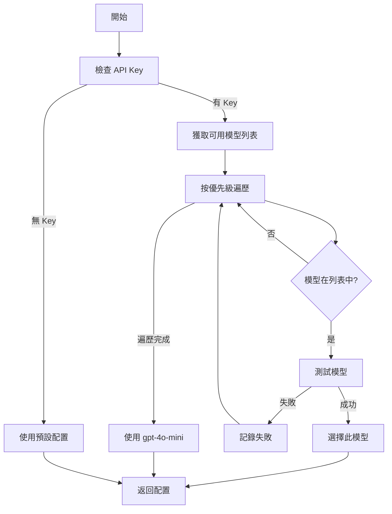

# GPT-5 模型選擇策略

## 📋 概述

本文檔說明 Prompt-Scribe 如何動態選擇和測試 OpenAI 模型，確保使用最佳可用的模型。

## 🎯 選擇策略

### 優先級順序

系統會按照以下優先級嘗試選擇模型：

1. **gpt-5-nano** - 最經濟，適合高通量任務
2. **gpt-5-mini** - 平衡性能和成本
3. **gpt-5** - 最強大的推理能力
4. **gpt-4o** - 多模態旗艦模型
5. **gpt-4o-mini** - 快速經濟的模型（默認備用）
6. **gpt-4-turbo** - GPT-4 系列的高性能版本
7. **gpt-3.5-turbo** - 最後的備用選項

### 選擇流程



## 🧪 模型測試

### 測試邏輯

每個模型在被選擇前都會經過測試：

```python
def test_model(model: str) -> bool:
    """
    測試步驟：
    1. 發送簡單的測試請求
    2. 檢查 HTTP 狀態碼 (200)
    3. 檢查回應內容是否為空
    4. 驗證回應格式是否正確
    """
```

### 測試條件

✅ **通過測試**：
- HTTP 200 OK
- 回應內容不為空
- Token 使用正常

❌ **測試失敗**：
- HTTP 4xx/5xx 錯誤
- 回應內容為空字符串
- 請求超時
- JSON 解析失敗

## 🔍 問題診斷

### GPT-5 系列返回空內容

**症狀**：
```
HTTP Request: POST https://api.openai.com/v1/chat/completions "HTTP/1.1 200 OK"
✅ API 回應成功
📦 回應內容:
  - 長度: 0 字符
```

**可能原因**：
1. 模型尚未正式發布
2. API Key 沒有該模型的訪問權限
3. 模型名稱錯誤

**解決方案**：
- 系統會自動檢測並切換到下一個可用模型
- 手動設置環境變數: `OPENAI_MODEL=gpt-4o-mini`

## 🛠️ 配置選項

### 環境變數

```bash
# 強制使用特定模型
OPENAI_MODEL=gpt-4o-mini

# 啟用/禁用 OpenAI 集成
ENABLE_OPENAI_INTEGRATION=true

# API Key
OPENAI_API_KEY=sk-your-key-here
```

### 配置文件

在 `src/api/config.py` 中：

```python
class Settings(BaseSettings):
    openai_model: str = "gpt-4o-mini"  # 預設模型
    enable_openai_integration: bool = True
```

## 📊 日誌解讀

### 正常啟動

```
✅ 動態選擇模型: gpt-4o-mini
🤖 GPT-5 Nano 客戶端初始化
  - 模型: gpt-4o-mini
  - API Key 已設置: ✅ 是
  - 功能啟用: ✅ 是
```

### GPT-5 不可用，自動降級

```
⚠️ 模型 gpt-5-nano 可能不可用，自動切換到 gpt-4o-mini
✅ 模型 gpt-4o-mini 測試成功
```

### 所有測試失敗

```
⚠️ 未找到任何可用模型，使用預設值 gpt-4o-mini
```

## 🔄 動態選擇流程

1. **初始化階段**
   - 讀取環境變數
   - 檢查 API Key

2. **模型發現**
   - 調用 OpenAI API 獲取模型列表
   - 過濾出 GPT 系列模型

3. **模型測試**
   - 按優先級逐個測試
   - 檢測空回應問題
   - 記錄測試結果

4. **模型選擇**
   - 選擇第一個通過測試的模型
   - 如果都失敗，使用 gpt-4o-mini

## 🎯 最佳實踐

### 本地開發

```bash
# 1. 設置 API Key
$env:OPENAI_API_KEY = "sk-your-key-here"

# 2. 運行診斷工具
python diagnose_model.py

# 3. 根據診斷結果設置模型
$env:OPENAI_MODEL = "gpt-4o-mini"

# 4. 啟動伺服器
python run_server.py
```

### Zeabur 部署

在 Zeabur 環境變數中設置：

```
OPENAI_API_KEY=sk-your-key-here
OPENAI_MODEL=gpt-4o-mini
ENABLE_OPENAI_INTEGRATION=true
```

## 🚨 故障排除

### 問題 1: 模型返回空內容

**檢查**：
```bash
python diagnose_model.py
```

**解決**：
設置可用的模型：
```bash
$env:OPENAI_MODEL = "gpt-4o-mini"
```

### 問題 2: API Key 無效

**症狀**：
```
HTTP 401 Unauthorized
```

**解決**：
- 檢查 API Key 是否正確
- 確認 API Key 有效期
- 檢查賬戶餘額

### 問題 3: 所有模型都失敗

**檢查**：
1. 網路連接
2. API Key 權限
3. OpenAI 服務狀態

## 📈 性能優化

### 快取策略

- 模型列表快取 1 小時
- 測試結果快取 10 分鐘
- 避免重複測試

### 超時設置

```python
test_timeout = 10  # 秒
api_timeout = 30   # 秒
```

## 🔐 安全性

### API Key 管理

- ✅ 使用環境變數
- ✅ 不要硬編碼在代碼中
- ✅ 不要提交到 Git
- ✅ 定期輪換

### 日誌脫敏

API Key 在日誌中只顯示：
- 前 8 碼
- 後 4 碼

示例：`sk-proj12...xyz9`

## 📚 相關文檔

- [OpenAI 模型比較](./OPENAI_MODEL_COMPARISON.md)
- [GPT-5 結構化輸出優化](./GPT5_STRUCTURED_OUTPUT_OPTIMIZATION_COMPLETE.md)
- [Zeabur 配置指南](./GPT5_NANO_ZEABUR_CONFIG.md)

## 🎓 總結

- **自動化**: 系統會自動選擇最佳模型
- **容錯性**: 多層降級策略確保服務可用
- **透明度**: 詳細的日誌記錄所有決策
- **靈活性**: 支持手動配置覆蓋

---

**最後更新**: 2025-10-21
**版本**: v2.0.0
