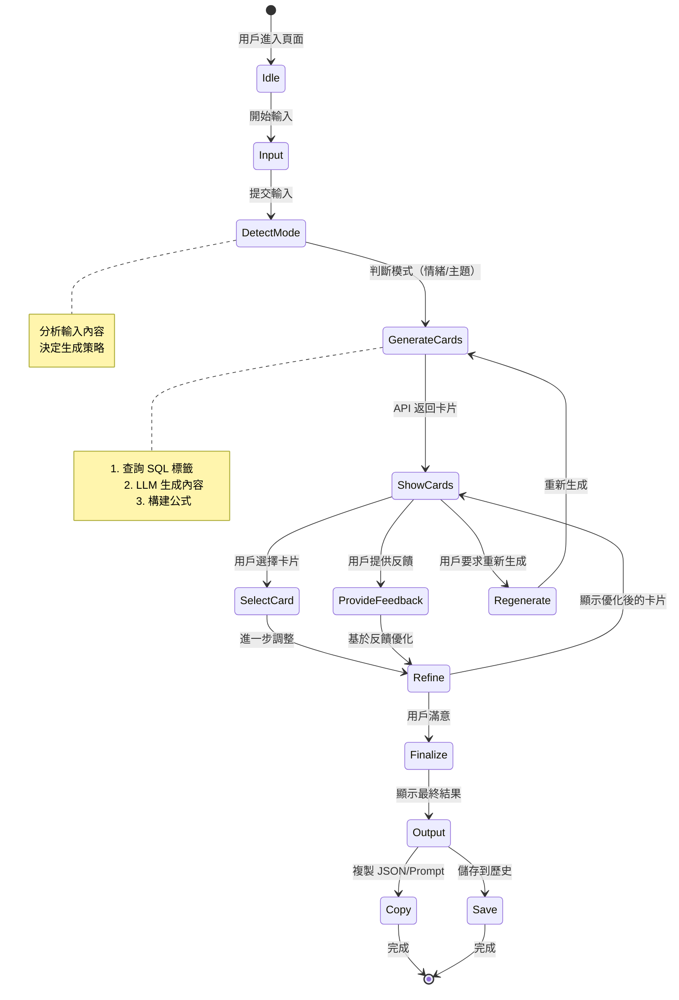

# 📋 Inspire 功能開發計畫

> **Prompt-Scribe Inspire 模塊 - AI 靈感卡生成系統**

**計畫編號**: PLAN-2025-004  
**版本**: 1.0.0  
**建立日期**: 2025-10-17  
**狀態**: 規劃階段

---

## 🎯 一、功能概述

### 1.1 核心目標

**Inspire** 是 Prompt-Scribe 的創新功能模塊，旨在通過**對話式引導**幫助使用者：

1. 🎨 **降低創作門檻** - 從「不知道怎麼描述」到「獲得靈感卡」
2. 💡 **提供視覺化靈感** - 將抽象情緒轉化為具體的 Prompt 卡片
3. 🔄 **迭代優化** - 通過對話式反饋持續精煉
4. 📋 **結構化輸出** - 生成可直接使用的 JSON / Prompt 格式

### 1.2 使用者旅程

```
使用者輸入模糊感覺
    ↓
AI 判斷模式（情緒/主題）
    ↓
生成 3 張靈感卡
    ↓
使用者選擇 + 提供反饋
    ↓
AI 迭代優化
    ↓
最終確認並複製輸出
```

### 1.3 與現有功能的區別

| 功能 | 現有標籤推薦 | **新增 Inspire** |
|------|-------------|-----------------|
| **輸入方式** | 具體標籤或描述 | 模糊情緒或感覺 |
| **輸出形式** | 標籤列表 | 結構化靈感卡 |
| **互動模式** | 單次查詢 | 多輪對話引導 |
| **目標用戶** | 有經驗的創作者 | 新手或需要靈感的創作者 |
| **AI 角色** | 推薦助手 | 創意夥伴 |

---

## 🏗️ 二、前端架構

### 2.1 目錄結構

```
app/
├── layout.tsx                      # 全域框架（Header / Footer）
├── page.tsx                        # Hero + Entry
│
├── inspire/                        # ⭐ 新增 Inspire 模塊
│   ├── page.tsx                   # Inspire 主頁
│   │
│   ├── components/                # 功能組件
│   │   ├── InputBox.tsx          # 使用者輸入框
│   │   ├── InspirationCards.tsx  # 靈感卡展示
│   │   ├── FeedbackPanel.tsx     # 對話引導面板
│   │   ├── ResultPanel.tsx       # JSON 輸出面板
│   │   ├── Loader.tsx            # 載入動畫
│   │   └── CardPreview.tsx       # 卡片預覽（可選）
│   │
│   ├── hooks/                     # 自定義 Hooks
│   │   ├── useSession.ts         # Session 管理（localStorage + UUID）
│   │   ├── useInspiration.ts     # 靈感生成邏輯
│   │   └── useFeedback.ts        # 反饋處理
│   │
│   └── lib/                       # 工具函數
│       ├── api.ts                # API 呼叫封裝
│       ├── formula.ts            # 公式構建邏輯
│       └── session.ts            # Session 工具函數
│
components/
├── ui/                            # Shadcn 組件庫
│   ├── button.tsx
│   ├── card.tsx
│   ├── input.tsx
│   ├── textarea.tsx
│   └── ...
│
└── shared/                        # 共用組件
    ├── CopyButton.tsx            # 複製按鈕
    ├── ToastProvider.tsx         # Toast 通知
    └── LoadingShimmer.tsx        # Shimmer 載入效果
```

### 2.2 頁面佈局設計

#### Inspire 主頁 (`/inspire/page.tsx`)

```
┌─────────────────────────────────────────┐
│  [← Back]    Inspire  ✨              │  ← Header
├─────────────────────────────────────────┤
│                                         │
│  💭 描述你想要的感覺或主題...            │  ← InputBox
│  [_____________________________]  [→]   │
│                                         │
├─────────────────────────────────────────┤
│                                         │
│  🎴 靈感卡片                            │  ← InspirationCards
│                                         │
│  ┌──────┐  ┌──────┐  ┌──────┐        │
│  │Card 1│  │Card 2│  │Card 3│        │
│  │      │  │      │  │      │        │
│  │[選擇]│  │[選擇]│  │[選擇]│        │
│  └──────┘  └──────┘  └──────┘        │
│                                         │
├─────────────────────────────────────────┤
│                                         │
│  💬 反饋與調整                          │  ← FeedbackPanel
│  [想要更夢幻一點...]                    │
│  [調整場景] [改變風格] [重新生成]      │
│                                         │
├─────────────────────────────────────────┤
│                                         │
│  📋 最終結果                            │  ← ResultPanel
│  {                                      │
│    "subject": "lonely girl...",        │
│    "scene": "misty forest",            │
│    ...                                  │
│  }                                      │
│  [複製 JSON] [複製 Prompt] [儲存]      │
│                                         │
└─────────────────────────────────────────┘
```

---

## 🔗 三、前後端交互規格

### 3.1 API 端點定義

#### **POST `/api/inspire/generate`**

**用途**: 根據使用者輸入生成靈感卡

**Request Body**:
```typescript
{
  input: string;              // 使用者輸入的情緒或主題
  session_id: string;         // UUID v4
  mode?: 'auto' | 'emotion' | 'theme';  // 可選，預設 auto
  round?: number;             // 對話輪次，預設 1
}
```

**Response**:
```typescript
{
  mode: 'emotion' | 'theme';
  round: number;
  cards: InspirationCard[];   // 3 張靈感卡
  suggestions?: string[];     // AI 提供的下一步建議
}
```

**範例**:
```json
// Request
{
  "input": "孤獨又夢幻的感覺",
  "session_id": "550e8400-e29b-41d4-a716-446655440000",
  "mode": "auto"
}

// Response
{
  "mode": "emotion",
  "round": 1,
  "cards": [
    {
      "subject": "lonely girl in a misty forest",
      "outfit": "flowing white dress",
      "scene": "foggy dawn woods",
      "callback": "looking down gently",
      "lighting": "soft morning light",
      "lens": "85mm portrait",
      "angle": "eye level",
      "composition": "rule of thirds",
      "style": "dreamy, cinematic",
      "extra": "floating particles",
      "source_tags": ["dreamy", "mist", "soft light", "lonely"]
    },
    {
      "subject": "silhouette on a rainy street",
      "scene": "urban night rain",
      "callback": "walking alone",
      "lighting": "neon reflection",
      "style": "film noir",
      "source_tags": ["noir", "rain", "urban", "lonely"]
    },
    {
      "subject": "girl gazing at stars",
      "outfit": "casual hoodie",
      "scene": "rooftop at midnight",
      "callback": "looking up dreamily",
      "lighting": "moonlight",
      "style": "anime aesthetic",
      "source_tags": ["dreamy", "night", "stars", "contemplative"]
    }
  ],
  "suggestions": [
    "選擇一張你最喜歡的卡片",
    "或告訴我想要調整的方向"
  ]
}
```

#### **POST `/api/inspire/feedback`**

**用途**: 接收使用者選擇與回饋，生成優化版本

**Request Body**:
```typescript
{
  session_id: string;
  selected_card?: InspirationCard;  // 使用者選擇的卡片
  feedback: string;                 // 使用者的反饋文字
  next_action: 'refine' | 'regenerate' | 'finalize';
}
```

**Response**:
```typescript
{
  status: 'success' | 'error';
  refined_cards?: InspirationCard[];  // 優化後的卡片（1-3 張）
  final_result?: InspirationCard;     // 如果是 finalize
  message?: string;                   // AI 回應訊息
}
```

**範例**:
```json
// Request
{
  "session_id": "550e8400-e29b-41d4-a716-446655440000",
  "selected_card": {
    "scene": "misty forest",
    "style": "dreamy"
  },
  "feedback": "想更現實一點，減少夢幻感",
  "next_action": "refine"
}

// Response
{
  "status": "success",
  "refined_cards": [
    {
      "subject": "lone woman in forest",
      "scene": "forest at dusk",
      "lighting": "realistic golden hour sunlight",
      "style": "cinematic realism, photographic",
      "extra": "natural atmosphere",
      "source_tags": ["realistic", "forest", "golden hour"]
    }
  ],
  "message": "已調整為更寫實的風格，保留森林場景"
}
```

#### **GET `/api/inspire/session/:session_id`**

**用途**: 獲取 Session 歷史記錄

**Response**:
```typescript
{
  session_id: string;
  rounds: InspireRound[];
  current_state: {
    mode: 'emotion' | 'theme';
    round: number;
    selected_card?: InspirationCard;
  };
}
```

---

## 🗂️ 四、資料結構

### 4.1 TypeScript 型別定義

```typescript
// types/inspire.ts

/**
 * 靈感卡片結構
 * 基於 AI 人像創作公式設計
 */
interface InspirationCard {
  // 核心元素
  subject: string;              // 人物主體（必填）
  outfit?: string;              // 服裝造型
  scene: string;                // 場景環境（必填）
  callback?: string;            // 表情、動作、肢體
  
  // 視覺技術
  lighting?: string;            // 光影設定
  lens?: string;                // 鏡頭類型（如 "85mm portrait"）
  angle?: string;               // 機位角度（如 "eye level", "low angle"）
  composition?: string;         // 構圖方式（如 "rule of thirds"）
  
  // 風格與氛圍
  style: string;                // 畫面風格（必填）
  extra?: string;               // 特殊元素、輔助詞
  
  // 元數據
  source_tags: string[];        // 來源標籤（追溯性）
  confidence_score?: number;    // AI 信心度（0-1）
}

/**
 * 對話輪次記錄
 */
interface InspireRound {
  round: number;
  timestamp: string;
  input: string;
  mode: 'emotion' | 'theme';
  cards: InspirationCard[];
  selected_card?: InspirationCard;
  feedback?: string;
}

/**
 * Session 狀態
 */
interface InspirationSession {
  session_id: string;
  created_at: string;
  updated_at: string;
  mode: 'emotion' | 'theme';
  current_round: number;
  rounds: InspireRound[];
  
  // 當前狀態
  current_cards: InspirationCard[];
  selected_card?: InspirationCard;
  final_result?: InspirationCard;
  
  // 統計
  total_generations: number;
  total_feedbacks: number;
}

/**
 * API 請求/回應型別
 */
interface InspireGenerateRequest {
  input: string;
  session_id: string;
  mode?: 'auto' | 'emotion' | 'theme';
  round?: number;
}

interface InspireGenerateResponse {
  mode: 'emotion' | 'theme';
  round: number;
  cards: InspirationCard[];
  suggestions?: string[];
}

interface InspireFeedbackRequest {
  session_id: string;
  selected_card?: InspirationCard;
  feedback: string;
  next_action: 'refine' | 'regenerate' | 'finalize';
}

interface InspireFeedbackResponse {
  status: 'success' | 'error';
  refined_cards?: InspirationCard[];
  final_result?: InspirationCard;
  message?: string;
}
```

---

## 🧬 五、AI 人像創作公式

### 5.1 公式結構

```
完整 Prompt = 人物主體 + 服裝造型 + 場景設計 + 人像回調 + 
              光線 + 鏡頭 + 機位角度 + 構圖 + 風格 + 輔助詞
```

### 5.2 欄位說明與來源

| 欄位 | 英文 | 描述 | 資料來源 | 必填 |
|------|------|------|---------|------|
| 人物主體 | subject | 主要角色（如 "lonely girl"） | LLM + SQL 標籤 | ✅ |
| 服裝造型 | outfit | 穿著風格（如 "flowing white dress"） | LLM | ⭕ |
| 場景設計 | scene | 環境背景（如 "misty forest"） | SQL 標籤 | ✅ |
| 人像回調 | callback | 表情、動作（如 "looking down gently"） | LLM | ⭕ |
| 光線 | lighting | 光影效果（如 "soft morning light"） | SQL 標籤 | ⭕ |
| 鏡頭 | lens | 鏡頭類型（如 "85mm portrait"） | 固定選單 | ⭕ |
| 機位角度 | angle | 拍攝角度（如 "eye level"） | 固定選單 | ⭕ |
| 構圖 | composition | 構圖方式（如 "rule of thirds"） | SQL 標籤 | ⭕ |
| 風格 | style | 畫面風格（如 "cinematic, dreamy"） | SQL 標籤 | ✅ |
| 輔助詞 | extra | 特殊元素（如 "floating particles"） | LLM 自由補足 | ⭕ |

### 5.3 固定選單（Preset Options）

#### 鏡頭類型 (Lens)
```typescript
const LENS_OPTIONS = [
  { value: '85mm portrait', label: '85mm 人像鏡' },
  { value: '35mm', label: '35mm 標準鏡' },
  { value: '24mm wide', label: '24mm 廣角鏡' },
  { value: '50mm', label: '50mm 定焦鏡' },
  { value: 'macro', label: '微距鏡頭' },
  { value: 'telephoto', label: '長焦鏡頭' },
];
```

#### 機位角度 (Angle)
```typescript
const ANGLE_OPTIONS = [
  { value: 'eye level', label: '平視' },
  { value: 'low angle', label: '低角度仰視' },
  { value: 'high angle', label: '高角度俯視' },
  { value: 'dutch angle', label: '傾斜角度' },
  { value: 'bird\'s eye view', label: '鳥瞰視角' },
  { value: 'worm\'s eye view', label: '蟲視角' },
];
```

### 5.4 公式生成邏輯

```typescript
// lib/formula.ts

export function buildPromptFromCard(card: InspirationCard): string {
  const parts: string[] = [];
  
  // 1. 人物主體（必填）
  parts.push(card.subject);
  
  // 2. 服裝造型
  if (card.outfit) parts.push(card.outfit);
  
  // 3. 場景
  parts.push(card.scene);
  
  // 4. 人像回調
  if (card.callback) parts.push(card.callback);
  
  // 5. 光線
  if (card.lighting) parts.push(card.lighting);
  
  // 6. 鏡頭
  if (card.lens) parts.push(card.lens);
  
  // 7. 機位角度
  if (card.angle) parts.push(card.angle);
  
  // 8. 構圖
  if (card.composition) parts.push(card.composition);
  
  // 9. 風格
  parts.push(card.style);
  
  // 10. 輔助詞
  if (card.extra) parts.push(card.extra);
  
  return parts.join(', ');
}

// 範例輸出
// "lonely girl, flowing white dress, misty forest, looking down gently, 
//  soft morning light, 85mm portrait, eye level, rule of thirds, 
//  dreamy cinematic, floating particles"
```

---

## 🧭 六、狀態機流程

### 6.1 完整狀態圖



### 6.2 狀態管理（React）

```typescript
// hooks/useInspiration.ts

type InspireState = 
  | 'idle'
  | 'input'
  | 'generating'
  | 'showing'
  | 'feedback'
  | 'refining'
  | 'finalized';

interface UseInspirationReturn {
  state: InspireState;
  session: InspirationSession | null;
  cards: InspirationCard[];
  selectedCard: InspirationCard | null;
  
  // Actions
  generateCards: (input: string) => Promise<void>;
  selectCard: (card: InspirationCard) => void;
  provideFeedback: (feedback: string) => Promise<void>;
  regenerate: () => Promise<void>;
  finalize: () => void;
  reset: () => void;
}

export function useInspiration(): UseInspirationReturn {
  const [state, setState] = useState<InspireState>('idle');
  const [session, setSession] = useState<InspirationSession | null>(null);
  const [cards, setCards] = useState<InspirationCard[]>([]);
  const [selectedCard, setSelectedCard] = useState<InspirationCard | null>(null);
  
  // 實作邏輯...
  
  return {
    state,
    session,
    cards,
    selectedCard,
    generateCards,
    selectCard,
    provideFeedback,
    regenerate,
    finalize,
    reset,
  };
}
```

---

## 🎨 七、UI/UX 設計原則

### 7.1 核心設計理念

| 面向 | 原則 | 實作建議 |
|------|------|---------|
| **情緒設計** | 優先呈現感覺 | 使用柔和漸層、大量空白空間、圓角設計 |
| **對話節奏** | 1 問 1 答 | 控制文字節奏，避免冗長說明 |
| **卡片設計** | 視覺可閱讀性 | 主體明確、色彩分層、資訊層次清晰 |
| **響應速度** | 保持即時感 | Shimmer loading、Typing animation |
| **複製輸出** | 一鍵操作 | CopyButton 統一風格，Toast 即時反饋 |

### 7.2 視覺設計規範

#### 色彩系統

```typescript
// 主題色彩（基於 Tailwind Config）
const INSPIRE_COLORS = {
  brand: '#4CC9F0',           // 主色：夢幻藍
  brandLight: '#90E0EF',      // 淺藍
  brandDark: '#3A0CA3',       // 深紫藍
  
  card: '#FFFFFF',            // 卡片背景
  cardDark: '#18181B',        // 暗色卡片
  
  muted: '#F4F4F5',           // 次要背景
  border: '#E4E4E7',          // 邊框
  
  success: '#10B981',         // 成功狀態
  warning: '#F59E0B',         // 警告狀態
  error: '#EF4444',           // 錯誤狀態
};
```

#### 間距系統

```typescript
const SPACING = {
  card: 'p-6',                // 卡片內距
  section: 'my-8',            // 區塊間距
  element: 'mb-4',            // 元素間距
  tight: 'space-y-2',         // 緊湊排列
  comfortable: 'space-y-4',   // 舒適排列
};
```

#### 動畫效果

```typescript
const ANIMATIONS = {
  fadeIn: 'animate-fade-in',              // 淡入
  slideUp: 'animate-slide-up',            // 向上滑入
  float: 'animate-float-slow',            // 緩慢浮動
  shimmer: 'animate-shimmer',             // 載入閃爍
  typing: 'animate-typing',               // 打字效果
};
```

### 7.3 組件設計規範

#### InputBox（輸入框）

```tsx
<InputBox
  placeholder="描述你想要的感覺或主題..."
  onSubmit={handleGenerate}
  loading={isGenerating}
  disabled={state !== 'idle'}
  className="w-full"
/>
```

**設計要點**:
- 大號輸入框（h-16）
- Placeholder 使用引導性文字
- 載入時顯示動畫
- 支援 Enter 提交

#### InspirationCard（靈感卡）

```tsx
<InspirationCard
  card={card}
  selected={isSelected}
  onSelect={() => handleSelect(card)}
  className="hover:shadow-brand"
/>
```

**設計要點**:
- 卡片式佈局（圓角、陰影）
- Hover 時提升效果（transform + shadow）
- 選中狀態明顯標示（邊框發光）
- 資訊層次分明（主標題 > 詳細資訊 > 標籤）

#### FeedbackPanel（反饋面板）

```tsx
<FeedbackPanel
  onFeedback={handleFeedback}
  suggestions={aiSuggestions}
  quickActions={['調整場景', '改變風格', '重新生成']}
/>
```

**設計要點**:
- 對話式介面
- AI 建議以氣泡形式呈現
- 快速操作按鈕
- 輸入框支援多行

---

## 🗃️ 八、資料追蹤與分析

### 8.1 追蹤層級

#### 生成層（Generation Metrics）

追蹤每次卡片生成的詳細資訊：

```typescript
interface GenerationLog {
  session_id: string;
  round: number;
  input: string;
  mode: 'emotion' | 'theme';
  
  // 生成結果
  cards_count: number;
  cards_data: InspirationCard[];
  
  // 技術指標
  model: string;                    // 使用的 LLM 模型
  latency_ms: number;               // 回應時間
  cost_usd: number;                 // 成本
  
  // SQL 查詢
  sql_queries: number;              // SQL 查詢次數
  tags_used: string[];              // 使用的標籤
  
  // 時間戳
  created_at: string;
}
```

#### 使用層（Usage Metrics）

追蹤使用者行為模式：

```typescript
interface UsageLog {
  client_id: string;                // 匿名 ID
  session_id: string;
  
  // 行為統計
  total_rounds: number;
  total_cards_generated: number;
  total_feedbacks: number;
  finalized: boolean;
  
  // 時間分析
  session_duration_seconds: number;
  time_to_first_card: number;
  time_to_finalize: number;
  
  // 裝置資訊
  user_agent: string;
  viewport_width: number;
  
  created_at: string;
}
```

#### 反饋層（Feedback Metrics）

追蹤使用者反饋與偏好：

```typescript
interface FeedbackLog {
  session_id: string;
  round: number;
  
  // 選擇資訊
  selected_card_index: number;
  selected_scene: string;
  selected_style: string;
  
  // 反饋內容
  feedback_text: string;
  feedback_type: 'refine' | 'regenerate' | 'positive';
  
  // 評分（可選）
  rating?: 1 | 2 | 3 | 4 | 5;
  rating_reason?: string;
  
  created_at: string;
}
```

### 8.2 分析用途

| 資料類型 | 分析目標 | 應用場景 |
|---------|---------|---------|
| **生成層** | 模型效能與成本 | 優化 Prompt 策略、降低成本 |
| **使用層** | 使用頻率與留存 | 改善使用者體驗、提升轉換率 |
| **反饋層** | 品質與偏好 | 調整推薦策略、訓練模型 |

### 8.3 資料收集實作

```typescript
// lib/analytics.ts

export async function trackGeneration(data: GenerationLog) {
  await fetch('/api/analytics/generation', {
    method: 'POST',
    body: JSON.stringify(data),
  });
}

export async function trackUsage(data: UsageLog) {
  await fetch('/api/analytics/usage', {
    method: 'POST',
    body: JSON.stringify(data),
  });
}

export async function trackFeedback(data: FeedbackLog) {
  await fetch('/api/analytics/feedback', {
    method: 'POST',
    body: JSON.stringify(data),
  });
}
```

---

## 🔒 九、驗證與授權設計

### 9.1 認證策略

```typescript
// 匿名登入（Supabase Auth）
const AUTHENTICATION = {
  method: 'anonymous',
  provider: 'supabase',
  token: 'anon_token',
};
```

**實作要點**:
- 使用 Supabase 匿名認證
- 不需要使用者註冊/登入
- 自動生成 UUID 作為 Session ID
- Token 存儲在 localStorage

### 9.2 Session 管理

```typescript
// hooks/useSession.ts

export function useSession() {
  const [sessionId, setSessionId] = useState<string | null>(null);
  
  useEffect(() => {
    // 從 localStorage 獲取或創建新 Session
    let id = localStorage.getItem('inspire_session_id');
    
    if (!id) {
      id = uuidv4();
      localStorage.setItem('inspire_session_id', id);
    }
    
    setSessionId(id);
  }, []);
  
  const resetSession = () => {
    const newId = uuidv4();
    localStorage.setItem('inspire_session_id', newId);
    setSessionId(newId);
  };
  
  return { sessionId, resetSession };
}
```

### 9.3 CORS 設定

```typescript
// vercel.json 或 zeabur 配置
{
  "headers": [
    {
      "source": "/api/(.*)",
      "headers": [
        { "key": "Access-Control-Allow-Origin", "value": "*" },
        { "key": "Access-Control-Allow-Methods", "value": "GET,POST,OPTIONS" },
        { "key": "Access-Control-Allow-Headers", "value": "Content-Type, Authorization" }
      ]
    }
  ]
}
```

### 9.4 環境變數管理

```bash
# .env.local（不上傳到 Git）

# Supabase
NEXT_PUBLIC_SUPABASE_URL=https://xxx.supabase.co
NEXT_PUBLIC_SUPABASE_ANON_KEY=eyJhbGciOiJIUzI1NiIsInR5cCI6IkpXVCJ9...
SUPABASE_SERVICE_ROLE_KEY=eyJhbGciOiJIUzI1NiIsInR5cCI6IkpXVCJ9...

# API 端點
NEXT_PUBLIC_API_URL=https://prompt-scribe-api.vercel.app

# LLM（如需直接調用）
OPENAI_API_KEY=sk-...
OPENAI_MODEL=gpt-4-turbo-preview

# 功能開關
NEXT_PUBLIC_ENABLE_ANALYTICS=true
NEXT_PUBLIC_ENABLE_FEEDBACK=true
```

---

## ⚙️ 十、技術棧與環境

### 10.1 完整技術棧

| 類別 | 技術選擇 | 版本要求 | 用途 |
|------|---------|---------|------|
| **前端框架** | Next.js | 14.x (App Router) | SSR/SSG，路由管理 |
| **UI 框架** | Shadcn/UI | latest | 組件庫 |
| **樣式** | Tailwind CSS | 3.4+ | 樣式系統 |
| **動畫** | Framer Motion | 11.x | 動畫效果 |
| **狀態管理** | Zustand | 4.x | 輕量狀態管理 |
| **資料請求** | React Query | 5.x | 伺服器狀態管理 |
| **型別** | TypeScript | 5.x | 類型安全 |
| **資料庫** | Supabase | latest | PostgreSQL + Auth |
| **本地存儲** | localStorage | - | Session 管理 |
| **部署** | Vercel | - | 前端部署 |
| **後端部署** | Zeabur | - | API 服務 |

### 10.2 開發環境配置

```json
// package.json（新增依賴）
{
  "dependencies": {
    "framer-motion": "^11.0.0",
    "@tanstack/react-query": "^5.0.0",
    "zustand": "^4.5.0",
    "uuid": "^9.0.1"
  },
  "devDependencies": {
    "@types/uuid": "^9.0.7"
  }
}
```

### 10.3 部署配置

#### Vercel 配置

```json
// vercel.json
{
  "buildCommand": "npm run build",
  "outputDirectory": ".next",
  "framework": "nextjs",
  "env": {
    "NEXT_PUBLIC_API_URL": "@inspire-api-url",
    "NEXT_PUBLIC_SUPABASE_URL": "@supabase-url",
    "NEXT_PUBLIC_SUPABASE_ANON_KEY": "@supabase-anon-key"
  },
  "rewrites": [
    {
      "source": "/api/inspire/:path*",
      "destination": "https://inspire-api.zeabur.app/api/inspire/:path*"
    }
  ]
}
```

#### Zeabur 配置（後端 API）

```yaml
# zeabur.yaml
services:
  - name: inspire-api
    type: python
    build:
      dockerfile: Dockerfile
    env:
      - SUPABASE_URL
      - SUPABASE_SERVICE_ROLE_KEY
      - OPENAI_API_KEY
    ports:
      - 8000
```

---

## 📐 十一、Tailwind Config 擴展

### 11.1 設計 Token 定義

```typescript
// tailwind.config.ts（擴展配置）

export default {
  theme: {
    extend: {
      // 品牌色彩（Inspire 專用）
      colors: {
        inspire: {
          primary: '#4CC9F0',      // 主色
          light: '#90E0EF',        // 淺色
          dark: '#3A0CA3',         // 深色
          accent: '#F72585',       // 強調色
          muted: '#CDB4DB',        // 柔和色
        },
      },
      
      // 陰影效果
      boxShadow: {
        'card-hover': '0 8px 30px rgba(76, 201, 240, 0.3)',
        'card-selected': '0 0 0 3px rgba(76, 201, 240, 0.5)',
        'glow': '0 0 20px rgba(76, 201, 240, 0.6)',
      },
      
      // 動畫
      animation: {
        'fade-in': 'fadeIn 0.6s ease-in-out',
        'slide-up': 'slideUp 0.4s ease-out',
        'float-slow': 'float 6s ease-in-out infinite',
        'shimmer': 'shimmer 2s linear infinite',
        'typing': 'typing 2s steps(40, end)',
      },
      
      keyframes: {
        fadeIn: {
          from: { opacity: '0' },
          to: { opacity: '1' },
        },
        slideUp: {
          from: {
            opacity: '0',
            transform: 'translateY(20px)',
          },
          to: {
            opacity: '1',
            transform: 'translateY(0)',
          },
        },
        float: {
          '0%, 100%': { transform: 'translateY(0px)' },
          '50%': { transform: 'translateY(-8px)' },
        },
        shimmer: {
          '0%': { backgroundPosition: '-200% 0' },
          '100%': { backgroundPosition: '200% 0' },
        },
        typing: {
          from: { width: '0' },
          to: { width: '100%' },
        },
      },
      
      // 漸層
      backgroundImage: {
        'inspire-gradient': 'linear-gradient(135deg, #4CC9F0 0%, #3A0CA3 100%)',
        'card-gradient': 'linear-gradient(180deg, #FFFFFF 0%, #F8F9FA 100%)',
      },
    },
  },
};
```

### 11.2 語意 Token 應用

```typescript
// components/inspire/InspirationCard.tsx

export function InspirationCard({ card }: { card: InspirationCard }) {
  return (
    <div className="
      bg-card 
      border border-border 
      rounded-2xl 
      p-6 
      shadow-card
      hover:shadow-card-hover
      hover:scale-105
      transition-all duration-300
      animate-fade-in
    ">
      <h3 className="text-inspire-primary font-bold text-xl mb-2">
        {card.subject}
      </h3>
      <p className="text-muted-foreground mb-4">
        {card.scene}
      </p>
      {/* ... */}
    </div>
  );
}
```

---

## 📊 十二、開發階段與時程

### 12.1 開發階段劃分

| 階段 | 任務 | 預估時間 | 優先級 | 交付物 |
|------|------|---------|--------|--------|
| **P0: 規劃** | 完成 PRD、設計稿 | 4h | High | 本文檔、設計稿 |
| **P1: 環境設置** | Next.js 配置、依賴安裝 | 4h | High | 可運行的骨架 |
| **P2: 基礎組件** | 實作 UI 組件（InputBox, Card, Panel） | 12h | High | 6 個基礎組件 |
| **P3: API 整合** | 實作 API 呼叫、資料流 | 8h | High | API 客戶端 |
| **P4: 狀態管理** | Session、狀態機、Hooks | 8h | High | 完整狀態邏輯 |
| **P5: 動畫優化** | 載入動畫、過渡效果 | 6h | Medium | 流暢體驗 |
| **P6: 測試除錯** | 單元測試、整合測試 | 8h | High | 測試覆蓋 ≥80% |
| **P7: 部署上線** | Vercel 部署、監控設置 | 4h | High | 生產環境 |
| **總計** | - | **54h** | - | **約 7 工作天** |

### 12.2 里程碑

**M1: 原型可用（P1-P2）** - Day 2
- 基本頁面和組件
- 靜態資料展示

**M2: 功能完整（P3-P4）** - Day 4
- API 整合完成
- 完整交互流程

**M3: 體驗優化（P5-P6）** - Day 6
- 動畫流暢
- 測試通過

**M4: 生產就緒（P7）** - Day 7
- 部署完成
- 監控運行

---

## ✅ 十三、驗收標準

### 13.1 功能驗收

- [ ] 使用者可以輸入情緒/主題並獲得 3 張靈感卡
- [ ] 靈感卡包含完整的公式欄位（subject, scene, style 等）
- [ ] 使用者可以選擇卡片並提供反饋
- [ ] AI 根據反饋生成優化版本
- [ ] 使用者可以複製 JSON 和 Prompt 格式
- [ ] Session 自動管理（UUID + localStorage）
- [ ] 支援多輪對話（至少 3 輪）

### 13.2 效能驗收

- [ ] 首次載入 < 2 秒
- [ ] API 回應時間 < 5 秒（P90）
- [ ] 動畫流暢（60 FPS）
- [ ] 無記憶體洩漏
- [ ] 支援離線狀態提示

### 13.3 體驗驗收

- [ ] 載入動畫平滑（shimmer effect）
- [ ] 複製操作有即時反饋（toast）
- [ ] 響應式設計完美適配（mobile + desktop）
- [ ] 無障礙支援（鍵盤導航、ARIA 標籤）
- [ ] 錯誤處理友好（清晰的錯誤訊息）

### 13.4 測試驗收

- [ ] 單元測試覆蓋率 ≥ 80%
- [ ] E2E 測試覆蓋主流程
- [ ] 跨瀏覽器測試通過（Chrome, Firefox, Safari）
- [ ] 移動端測試通過（iOS, Android）

---

## 🔮 十四、未來擴展

### 14.1 V1.1 規劃

- 🎨 **風格預設** - 提供常見風格模板（賽博龐克、夢幻、寫實等）
- 💾 **收藏功能** - 使用者可收藏喜歡的卡片
- 📊 **歷史記錄** - 查看過往生成的靈感卡
- 🔄 **批量生成** - 一次生成多組靈感卡

### 14.2 V2.0 規劃

- 👤 **帳號系統** - 支援登入、雲端同步
- 🤝 **分享功能** - 分享靈感卡給其他使用者
- 🎭 **社群模板** - 使用者貢獻的優質卡片
- 🔧 **進階編輯** - 自定義公式欄位
- 📈 **數據分析** - 個人化推薦

---

## 📚 附錄

### 附錄 A: 完整 API 規格

參見 `contracts/inspire-api-spec.yaml`

### 附錄 B: 資料庫 Schema

參見 `contracts/inspire-db-schema.sql`

### 附錄 C: Tailwind 樣式指南

參見 `docs/TAILWIND_INSPIRE_GUIDE.md`

### 附錄 D: 組件文檔

參見 `docs/INSPIRE_COMPONENTS.md`

---

**計畫文檔結束**

**版本**: 1.0.0  
**建立日期**: 2025-10-17  
**維護者**: Prompt-Scribe Team

---

## 📞 聯繫與反饋

如有任何問題或建議，請：
- 查看專案 README
- 提交 GitHub Issue
- 聯繫開發團隊

**讓我們一起打造最棒的 AI 靈感工具！** ✨

