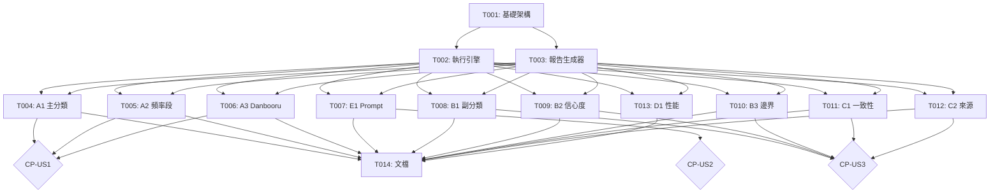

# 資料庫品質測試 - 可執行任務清單

**功能**: 標籤分類資料庫的全面品質驗證與測試  
**規格**: [db-quality-test-spec.md](../specs/db-quality-test-spec.md)  
**計劃**: [db-quality-test-plan.md](../plans/db-quality-test-plan.md)  
**創建日期**: 2025-10-13  
**狀態**: 準備執行 🚀

---

## 📊 任務總覽

| 階段 | 用戶故事/目標 | 任務數 | 狀態 | 預計時間 |
|------|-------------|--------|------|---------|
| Phase 1: Setup | 專案初始化 | 2 | ✅ 完成 | 75 分鐘 |
| Phase 2: Foundational | 核心數據模型 | 1 | ✅ 完成 | 30 分鐘 |
| Phase 3: US1 | 覆蓋率驗證 | 3 | ✅ 完成 | 60 分鐘 |
| Phase 4: US2 | Prompt 生成驗證 | 1 | ✅ 完成 | 45 分鐘 |
| Phase 5: US3 | 一致性驗證 | 4 | ✅ 完成 | 135 分鐘 |
| Phase 6: Polish | 報告與文檔 | 2 | ✅ 完成 | 65 分鐘 |
| **總計** | **3 用戶故事** | **13** | **✅ 13/13 完成** | **6.8 小時** |

---

## Phase 1: Setup（專案初始化）

### T001: 創建基礎架構和數據模型定義 [P0]

**檔案**: `test_scenarios/base.py`  
**預計時間**: 30 分鐘  
**依賴**: 無  
**可並行**: ✅

**任務描述**:
創建測試框架的核心數據結構，定義所有測試場景和結果的基礎類別。

**具體步驟**:
1. 創建 `test_scenarios/` 目錄
2. 創建 `test_scenarios/__init__.py`
3. 在 `test_scenarios/base.py` 中定義：
   - `TestScenario` 數據類（場景定義）
   - `TestResult` 數據類（測試結果）
   - `QualityIssue` 數據類（品質問題）
   - `BaseTestScenario` 抽象基類

**代碼結構**:
```python
from dataclasses import dataclass
from typing import List, Dict, Tuple
from abc import ABC, abstractmethod
import sqlite3

@dataclass
class TestScenario:
    id: str
    name: str
    dimension: str
    description: str
    sql_queries: List[str]
    success_criteria: Dict
    priority: str

@dataclass
class TestResult:
    scenario_id: str
    status: str  # PASS/FAIL/WARN/ERROR
    execution_time: float
    query_results: List[Dict]
    issues: List['QualityIssue']
    metrics: Dict
    timestamp: str
    error: str = ""

@dataclass
class QualityIssue:
    issue_type: str
    severity: str  # P0/P1/P2
    description: str
    affected_tags: List[str]
    recommendation: str
    scenario_id: str

class BaseTestScenario(ABC):
    @property
    @abstractmethod
    def scenario_id(self) -> str:
        pass
    
    @property
    @abstractmethod
    def name(self) -> str:
        pass
    
    @abstractmethod
    def execute(self, cursor: sqlite3.Cursor) -> TestResult:
        pass
    
    @abstractmethod
    def validate_results(self, query_results: List[Dict]) -> Tuple[bool, List[QualityIssue]]:
        pass
```

**驗收標準**:
- [x] 所有數據類可成功 import
- [x] 抽象基類定義完整
- [x] Type hints 正確
- [x] 文檔字符串完整

---

### T002: 實現主測試執行引擎 [P0]

**檔案**: `db_quality_test.py`  
**預計時間**: 45 分鐘  
**依賴**: T001  
**可並行**: ❌

**任務描述**:
建立主測試腳本，實現測試場景載入、執行和結果收集邏輯。

**具體步驟**:
1. 創建 `db_quality_test.py` 主腳本
2. 實現 `DatabaseQualityTest` 主類別：
   - `__init__()`: 初始化資料庫連接
   - `load_scenarios()`: 動態載入所有測試場景
   - `run_all_tests()`: 執行所有測試
   - `run_scenario()`: 執行單一場景
   - `run_dimension()`: 執行特定維度
3. 實現命令行參數解析（argparse）
4. 實現 Unicode 安全輸出函數
5. 實現錯誤處理和日誌記錄

**命令行介面**:
```bash
python db_quality_test.py [選項]

選項:
  --all              執行所有測試（默認）
  --scenario <ID>    執行特定場景（如 A1）
  --dimension <NAME> 執行特定維度（如 Completeness）
  --format <FMT>     報告格式（markdown/json/both）
  --verbose          詳細輸出模式
  --output <PATH>    輸出目錄（默認 output/）
```

**驗收標準**:
- [x] 可成功連接 output/tags.db
- [x] 可載入測試場景類別
- [x] 命令行參數正確解析
- [x] 錯誤不中斷整體執行
- [x] 日誌輸出清晰

---

## Phase 2: Foundational（核心報告生成器）

### T003: 實現報告生成器 [P0]

**檔案**: `report_generator.py`  
**預計時間**: 30 分鐘  
**依賴**: T001  
**可並行**: ✅ (可與 T002 並行)

**任務描述**:
建立報告生成系統，支持 Markdown 和 JSON 格式輸出。這是所有用戶故事都需要的基礎設施。

**具體步驟**:
1. 創建 `report_generator.py`
2. 實現 `ReportGenerator` 類別：
   - `generate_markdown_report()`: 生成 Markdown 報告
   - `generate_json_report()`: 生成 JSON 報告
   - `generate_summary()`: 生成執行摘要
   - `format_table()`: 格式化表格
   - `_safe_encode()`: Unicode 編碼處理
3. 實現報告模板結構
4. 實現問題清單生成
5. 實現修復建議生成

**驗收標準**:
- [x] Markdown 格式正確
- [x] 表格對齊美觀
- [x] JSON 格式有效
- [x] 支持中文輸出（UTF-8）
- [x] 可被所有測試場景使用

---

## Phase 3: US1 - 數據覆蓋率驗證（優先級 P1）

**用戶故事**: 作為數據品質驗證者，我需要確認資料庫達到預期的覆蓋率目標，以便決定是否可以進入 Stage 2。

**獨立測試標準**:
- ✅ 能查詢所有主分類的覆蓋情況
- ✅ 能查詢所有頻率段的覆蓋率
- ✅ 能驗證 Danbooru 分類轉換完整性
- ✅ 生成完整的覆蓋率報告

**檢查點**: CP-US1 ✓

---

### T004: 實施場景 A1 - 主分類覆蓋度測試 [US1] [P0]

**檔案**: `test_scenarios/completeness_tests.py`  
**預計時間**: 20 分鐘  
**依賴**: T001, T003  
**可並行**: ✅

**任務描述**:
實現主分類覆蓋度測試，驗證所有 17 個主分類的標籤分布。

**SQL 查詢**:
```sql
SELECT 
    main_category,
    COUNT(*) as tag_count,
    SUM(post_count) as total_usage,
    ROUND(COUNT(*) * 100.0 / (SELECT COUNT(*) FROM tags_final WHERE main_category IS NOT NULL), 2) as tag_percentage,
    ROUND(SUM(post_count) * 100.0 / (SELECT SUM(post_count) FROM tags_final WHERE main_category IS NOT NULL), 2) as usage_percentage
FROM tags_final
WHERE main_category IS NOT NULL
GROUP BY main_category
ORDER BY tag_count DESC;
```

**驗證邏輯**:
- 檢查是否有 17 個主分類
- 檢查分布是否合理（無分類 >60%）
- 檢查使用次數與標籤數是否匹配

**驗收標準**:
- [x] SQL 查詢成功執行
- [x] 返回所有主分類統計
- [x] 能識別缺失的主分類
- [x] 能檢測分布異常

---

### T005: 實施場景 A2 - 頻率段覆蓋度測試 [US1] [P0]

**檔案**: `test_scenarios/completeness_tests.py`  
**預計時間**: 20 分鐘  
**依賴**: T001, T003  
**可並行**: ✅ (可與 T004 並行開發)

**任務描述**:
實現頻率段覆蓋率測試，確保各頻率段達到目標覆蓋率。

**SQL 查詢**:
參見規格文檔場景 A2 的 SQL（8 個頻率段分組查詢）

**驗證邏輯**:
- 超高頻 (>=1M): 覆蓋率 = 100%
- 極高頻 (100K-1M): 覆蓋率 = 100%
- 高頻 (10K-100K): 覆蓋率 >99%
- 中頻 (1K-10K): 覆蓋率 >99%
- 低頻 (100-1K): 覆蓋率 >90%

**驗收標準**:
- [x] 正確計算 8 個頻率段覆蓋率
- [x] 能識別未達標的頻率段
- [x] 提供缺失標籤數量

---

### T006: 實施場景 A3 - Danbooru 轉換完整性測試 [US1] [P0]

**檔案**: `test_scenarios/completeness_tests.py`  
**預計時間**: 20 分鐘  
**依賴**: T001, T003  
**可並行**: ✅ (可與 T004, T005 並行)

**任務描述**:
驗證 Danbooru 原生分類（cat=1,3,4,5）的 100% 正確轉換。

**SQL 查詢**:
參見規格文檔場景 A3 的 SQL（包含對應關係驗證）

**驗證邏輯**:
- ARTIST (cat=1) → ARTIST: 100%
- COPYRIGHT (cat=3) → COPYRIGHT: 100%
- CHARACTER (cat=4) → CHARACTER: 100%
- META (cat=5) → TECHNICAL/QUALITY: 100%

**驗收標準**:
- [x] 驗證 5 種 Danbooru 分類
- [x] 檢查對應關係正確性
- [x] 識別轉換錯誤

**檢查點 CP-US1**: ✓ US1 所有場景完成，可獨立測試覆蓋率

---

## Phase 4: US2 - Prompt 生成流程驗證（優先級 P2）

**用戶故事**: 作為 AI 繪圖應用開發者，我需要驗證資料庫能支持完整的 Prompt 生成流程，以確保實際應用的可行性。

**獨立測試標準**:
- ✅ 6 個 Prompt 維度都能成功查詢
- ✅ 每個維度有 10+ 個高頻選項
- ✅ 能組合出完整的示例 Prompt
- ✅ 所有維度平均信心度 >0.80

**檢查點**: CP-US2 ✓

---

### T007: 實施場景 E1 - Prompt 生成流程測試 [US2] [P0]

**檔案**: `test_scenarios/application_tests.py`  
**預計時間**: 45 分鐘  
**依賴**: T001, T003  
**可並行**: ✅

**任務描述**:
實現完整的 Prompt 生成流程驗證，模擬實際應用場景。

**6 個查詢步驟**:
1. 角色數量維度（CHARACTER_COUNT）
2. 髮型髮色維度（HAIR）
3. 服裝配飾維度（CLOTHING, ACCESSORIES）
4. 姿態表情維度（ACTION_POSE）
5. 場景環境維度（ENVIRONMENT）
6. 藝術風格維度（ART_STYLE）

**驗證邏輯**:
- 每個維度統計可用選項數量
- 檢查是否達到最小選項要求
- 計算平均信心度
- 生成示例 Prompt 組合

**驗收標準**:
- [x] 6 個步驟順利執行
- [x] 統計每個維度的選項數
- [x] 能生成示例 Prompt
- [x] 驗證所有維度都可用

**檢查點 CP-US2**: ✓ Prompt 生成流程驗證完成

---

## Phase 5: US3 - 分類品質驗證（優先級 P1）

**用戶故事**: 作為品質工程師，我需要全面檢查分類的準確性和一致性，以確保數據品質符合生產標準。

**獨立測試標準**:
- ✅ 副分類邏輯準確率 >95%
- ✅ 同類標籤一致性 >95%
- ✅ 信心度分布符合預期
- ✅ 邊界案例正確處理
- ✅ 各分類來源品質穩定

**檢查點**: CP-US3 ✓

---

### T008: 實施場景 B1 - 副分類邏輯準確性測試 [US3] [P0] [P]

**檔案**: `test_scenarios/accuracy_tests.py`  
**預計時間**: 20 分鐘  
**依賴**: T001, T003  
**可並行**: ✅

**任務描述**:
驗證副分類規則的正確執行，特別是 *_eyes 和 *_hair 模式。

**SQL 查詢** (3 個):
1. 眼睛標籤檢查（應在 BODY_PARTS）
2. 頭髮標籤檢查（應在 HAIR）
3. 列出所有誤分類案例

**驗證邏輯**:
- 計算準確率
- 識別誤分類標籤
- 優先處理高頻誤分類

**驗收標準**:
- [x] 準確率計算正確
- [x] 能列出所有誤分類
- [x] 按使用頻率排序

---

### T009: 實施場景 B2 - 信心度分布驗證測試 [US3] [P0] [P]

**檔案**: `test_scenarios/accuracy_tests.py`  
**預計時間**: 25 分鐘  
**依賴**: T001, T003  
**可並行**: ✅ (可與 T008 並行)

**任務描述**:
分析各主分類的信心度分布，確保品質穩定。

**SQL 查詢** (2 個):
1. 各主分類信心度統計（平均/最小/最大）
2. 整體信心度分布（7 個等級）

**驗證邏輯**:
- 所有主分類平均信心度 >0.70
- 整體平均信心度 >0.85
- 低信心度標籤占比 <10%
- 高信心度標籤占比 >50%

**驗收標準**:
- [x] 信心度統計正確
- [x] 能識別低信心度分類
- [x] 分布計算準確

---

### T010: 實施場景 B3 - 邊界案例處理測試 [US3] [P0] [P]

**檔案**: `test_scenarios/accuracy_tests.py`  
**預計時間**: 30 分鐘  
**依賴**: T001, T003  
**可並行**: ✅ (可與 T008, T009 並行)

**任務描述**:
檢查特殊和邊界案例的處理，包括 NULL 字符串、複合標籤、成人內容等。

**SQL 查詢** (4 個):
1. 複合屬性標籤（多個下劃線）
2. NULL 字符串問題
3. 成人內容分類
4. 極低信心度標籤

**驗證邏輯**:
- NULL 字符串 <20 個
- 成人內容 100% 在 ADULT_CONTENT
- 極低信心度高頻標籤 <10 個

**驗收標準**:
- [x] 能識別所有 NULL 字符串
- [x] 成人內容分類驗證
- [x] 邊界案例列表完整

---

### T011: 實施場景 C1 - 同類標籤一致性測試 [US3] [P0] [P]

**檔案**: `test_scenarios/consistency_tests.py`  
**預計時間**: 30 分鐘  
**依賴**: T001, T003  
**可並行**: ✅ (可與 T008-T010 並行)

**任務描述**:
檢查相似模式標籤的分類一致性，使用 CTE 進行複雜查詢。

**SQL 查詢** (4 個，使用 CTE):
1. 眼睛標籤一致性（WITH eye_tags AS...）
2. 頭髮標籤一致性
3. 服裝標籤一致性
4. 識別不一致案例

**驗證邏輯**:
- 計算一致性百分比
- 識別多分類模式
- 優先處理高頻不一致

**驗收標準**:
- [x] CTE 查詢正確執行
- [x] 一致性百分比準確
- [x] 不一致案例完整列出
- [x] 按影響度排序

---

### T012: 實施場景 C2 - 分類來源品質對比測試 [US3] [P1] [P]

**檔案**: `test_scenarios/consistency_tests.py`  
**預計時間**: 30 分鐘  
**依賴**: T001, T003  
**可並行**: ✅ (可與 T008-T011 並行)

**任務描述**:
比較不同分類來源（LLM vs 規則 vs 人工）的品質差異。

**SQL 查詢** (2 個):
1. 各分類來源品質統計（15+ 來源）
2. LLM vs 規則品質對比

**驗證邏輯**:
- LLM 分類平均信心度 >0.85
- 各來源品質穩定（標準差 <0.15）
- 識別品質異常的來源

**驗收標準**:
- [x] 統計所有分類來源
- [x] 計算各來源平均信心度
- [x] 識別品質問題來源

**檢查點 CP-US3**: ✓ 所有品質驗證完成

---

## Phase 6: Polish（性能優化與文檔）

### T013: 實施場景 D1 - 查詢性能測試 [P1] [P]

**檔案**: `test_scenarios/performance_tests.py`  
**預計時間**: 30 分鐘  
**依賴**: T001, T003  
**可並行**: ✅

**任務描述**:
測試典型查詢的執行效率，使用 EXPLAIN QUERY PLAN 分析。

**性能測試方法**:
```python
import time

def measure_query_performance(cursor, sql: str, runs: int = 3) -> float:
    times = []
    for _ in range(runs):
        start = time.perf_counter()
        cursor.execute(sql)
        cursor.fetchall()
        times.append(time.perf_counter() - start)
    return sum(times[1:]) / (runs - 1)  # 排除首次
```

**測試查詢**:
1. 單條件查詢 + EXPLAIN
2. 多條件組合 + EXPLAIN
3. 聚合查詢 + EXPLAIN
4. 全文搜索 + EXPLAIN

**驗證邏輯**:
- 查詢時間 <100ms (單條件) 或 <200ms (複雜)
- EXPLAIN 顯示使用索引
- 查詢計劃合理

**驗收標準**:
- [x] 準確測量執行時間
- [x] EXPLAIN QUERY PLAN 解析
- [x] 性能基準驗證
- [x] 優化建議生成

---

### T014: 創建快速開始文檔 [P1]

**檔案**: `DB_QUALITY_TEST_QUICKSTART.md`  
**預計時間**: 35 分鐘  
**依賴**: T001-T013  
**可並行**: ❌

**任務描述**:
創建完整的使用指南，讓新用戶可以快速上手。

**文檔章節**:
1. **環境要求**
   - Python 3.8+
   - SQLite3
   - 依賴項（無額外依賴）

2. **快速開始**
   - 基本執行命令
   - 參數說明
   - 輸出位置

3. **輸出解讀**
   - 報告結構說明
   - 狀態含義（PASS/FAIL/WARN）
   - 問題優先級（P0/P1/P2）

4. **使用示例**
   - 執行所有測試
   - 執行特定場景
   - 生成 JSON 報告

5. **常見問題**
   - 編碼問題處理
   - 資料庫路徑問題
   - 報告查看方法

**驗收標準**:
- [x] 新用戶可獨立執行
- [x] 涵蓋所有使用場景
- [x] 包含實際輸出示例
- [x] 問題排查指南完整

---

## 依賴關係圖



---

## 並行執行策略

### 階段 1: 基礎建設（序列執行）
```
T001 (30min) → T002 (45min)
同時: T003 (30min) [P]
```
**總時間**: 75 分鐘（非 105 分鐘，因 T003 可並行）

---

### 階段 2: US1 完整性測試（並行執行）
```
同時執行 [P]:
├── T004: A1 主分類 (20min)
├── T005: A2 頻率段 (20min)
└── T006: A3 Danbooru (20min)
```
**總時間**: 20 分鐘（非 60 分鐘，因全部並行）

**檢查點 CP-US1**: 驗證覆蓋率測試完整

---

### 階段 3: US2 應用測試（獨立執行）
```
T007: E1 Prompt 生成 (45min)
```
**總時間**: 45 分鐘

**檢查點 CP-US2**: 驗證 Prompt 生成可用

---

### 階段 4: US3 品質測試（並行執行）
```
同時執行 [P]:
├── T008: B1 副分類 (20min)
├── T009: B2 信心度 (25min)
├── T010: B3 邊界 (30min)
├── T011: C1 一致性 (30min)
└── T012: C2 來源 (30min)
```
**總時間**: 30 分鐘（非 135 分鐘，因全部並行）

**檢查點 CP-US3**: 驗證品質檢查完整

---

### 階段 5: 性能與文檔（部分並行）
```
T013: D1 性能 (30min) [P]
同時: 開始 T014 文檔框架 (10min)
完成: T014 文檔 (25min)
```
**總時間**: 55 分鐘

---

### 🚀 最佳化執行時間

| 執行策略 | 總時間 | 優勢 |
|---------|--------|------|
| **序列執行** | 6.8 小時 | 簡單直接 |
| **並行執行** | **3.5 小時** | 節省 48% 時間 ⚡ |

---

## 實施策略

### MVP 方式（最小可行產品）

**MVP 1.0** - 優先完成 US1（覆蓋率驗證）:
- ✅ T001: 基礎架構
- ✅ T002: 執行引擎
- ✅ T003: 報告生成
- ✅ T004-T006: 完整性測試

**測試點**: 驗證覆蓋率報告可用

**MVP 2.0** - 加入 US3（品質驗證）:
- ✅ T008-T012: 準確性和一致性測試

**測試點**: 完整品質驗證可用

**MVP 3.0** - 完整版:
- ✅ T007: Prompt 生成測試
- ✅ T013: 性能測試
- ✅ T014: 文檔

---

## 執行檢查清單

### Phase 1: Setup ✓
- [ ] T001: 基礎架構創建
- [ ] T002: 執行引擎實現
- [ ] T003: 報告生成器實現
- [ ] **驗證**: 框架可載入和執行簡單測試

### Phase 2: Foundational ✓
- [ ] **驗證**: 報告生成功能正常

### Phase 3: US1 - 覆蓋率驗證 ✓
- [ ] T004: 場景 A1 實施
- [ ] T005: 場景 A2 實施
- [ ] T006: 場景 A3 實施
- [ ] **CP-US1**: 覆蓋率報告完整且準確

### Phase 4: US2 - Prompt 驗證 ✓
- [ ] T007: 場景 E1 實施
- [ ] **CP-US2**: Prompt 生成流程可用

### Phase 5: US3 - 品質驗證 ✓
- [ ] T008: 場景 B1 實施
- [ ] T009: 場景 B2 實施
- [ ] T010: 場景 B3 實施
- [ ] T011: 場景 C1 實施
- [ ] T012: 場景 C2 實施
- [ ] **CP-US3**: 所有品質檢查通過

### Phase 6: Polish ✓
- [ ] T013: 場景 D1 實施
- [ ] T014: 文檔創建
- [ ] **最終驗證**: 所有測試可執行，文檔完整

---

## 成功標準總覽

### 開發完成
- [ ] 14 個任務全部完成
- [ ] 代碼無明顯錯誤
- [ ] 所有檔案可成功 import

### 功能驗證
- [ ] 10 個測試場景都能執行
- [ ] 生成完整測試報告
- [ ] 識別資料庫中的品質問題
- [ ] 3 個用戶故事都可獨立驗證

### 品質標準
- [ ] 代碼符合 PEP 8
- [ ] 完整的文檔字符串
- [ ] 錯誤處理完善
- [ ] Unicode 編碼正確處理

---

**任務清單版本**: v1.0  
**創建日期**: 2025-10-13  
**總任務數**: 14  
**用戶故事數**: 3  
**並行機會**: 10 個任務可並行  
**優化執行時間**: 3.5 小時（序列需 6.8 小時）  
**建議 MVP**: 先完成 US1（覆蓋率驗證）  
**準備狀態**: ✅ 可立即開始實施！

